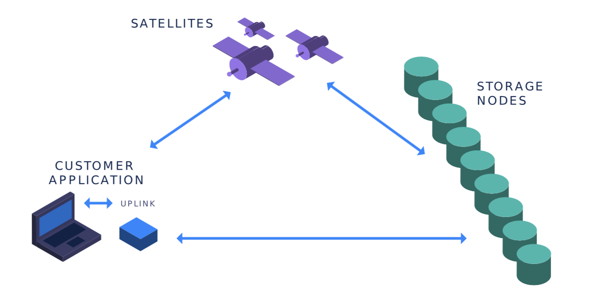
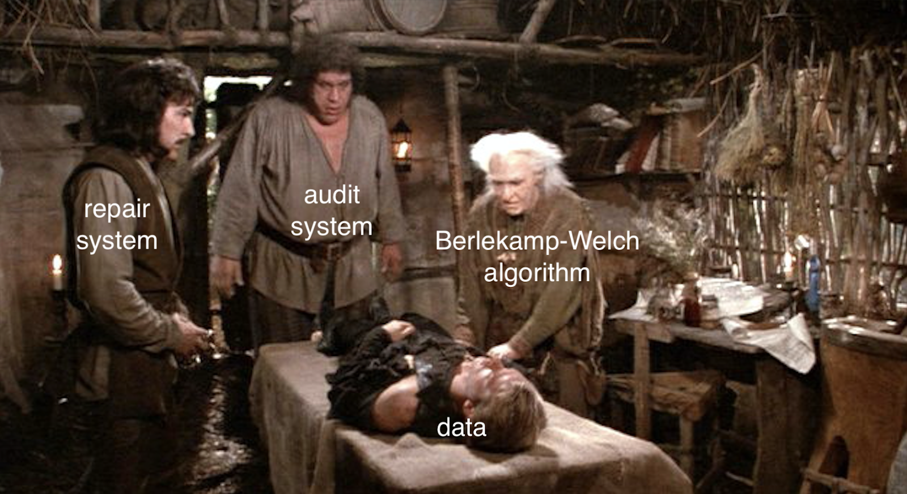
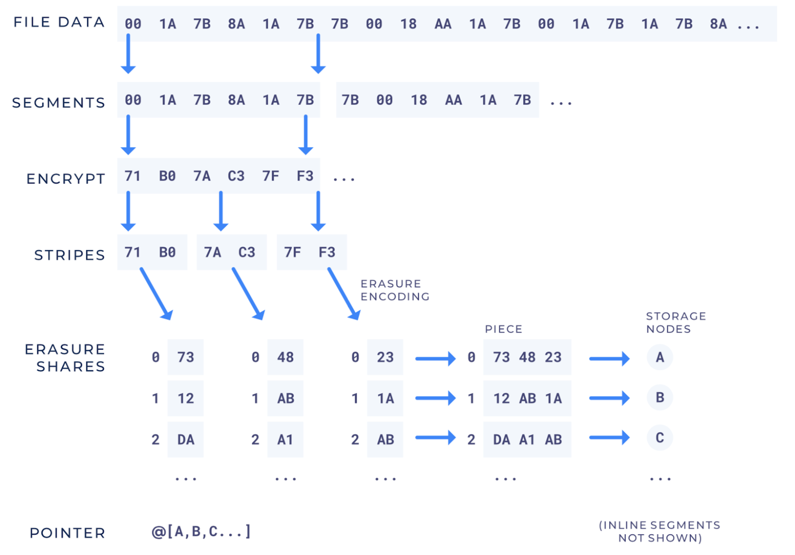

---
author:
  name: Natalie Villasana
date: '2018-12-12 00:00:00'
heroimage: ./3a7cf88738fc1956.png
layout: blog
metadata:
  description: "Today we\u2019re going to learn about the Storj V3 auditing and repair\
    \ systems! Auditing, oh man, I\u2019m already falling asleep, right? Well please\
    \ don\u2019t! Yes it\u2019s true that auditing does the sort of drudge work of\
    \ the storage system, in that it\u2019s a continuously running process, randomly\
    \ trying to downlo..."
  title: Decentralized Auditing and Repair! The Low-key Life of Data Resurrection
title: Decentralized Auditing and Repair! The Low-key Life of Data Resurrection

---

Today we’re going to learn about the Storj V3 auditing and repair systems! Auditing, oh man, I’m already falling asleep, right? Well please don’t! Yes it’s true that auditing does the sort of drudge work of the storage system, in that it’s a continuously running process, randomly trying to download little bytes of data, endlessly, forever. However, the repair system within our new V3 network steps in as auditing’s cooler, more wizardy sibling who saves the day by zapping jacked up data with its Reed-Solomon regeneration wand.

Speaking more specifically, the auditing system within our decentralized cloud storage network routinely verifies that storage nodes are indeed storing the data that they agreed to store. The network needs to run regular audits because if storage nodes go offline, or if data is deleted or corrupted, it is critical to both detect that failure and repair the data.

## A Little Network Overview

To better understand how the auditing process works, let’s first break down the core parts of our system. The V3 network has three major components: **Uplinks**, **Satellites**, and **storage nodes**.

**Uplinks** represent an application or service that wants to store or retrieve data. Unlike the Satellites or storage nodes, the Uplinks do not have to constantly remain online. Customers and clients will use Uplinks to upload data to the network, at which point it will perform encryption, erasure encoding, and coordinate with the Satellites and storage nodes about where the file’s pieces should be stored.

**Satellites** function as a collection of services that perform duties such as node discovery, caching node addresses, storing object metadata, recording storage node reputation, securing billing data, paying storage nodes, auditing, repairing, and managing user accounts.

Figure 4.1 from our white paper.

**Storage nodes** store data for others and are paid each month for the bandwidth they provide to the network and for the amount of (correct and untampered!) data they store. This creates a built-in incentive for storage nodes to behave “rationally” and not delete data upon receiving it or something, uh, unthinkable like that. Obviously we’re not naive to the fact that wild little animals do exist out there who would do such a thing. This is why we have audits and repairs. However, we do rely on the fact that majority of storage nodes are honest, upstanding nodes.

While it’s extremely important that storage node operators keep their nodes up and running, it’s also crucial that Satellites always remain online. If Satellites go offline, repair can’t work its magic and valuable data might be lost.

## Getting to Know Erasure Codes + Storj Vocab Attack

Reed-Solomon erasure codes enable us to recover lost data from a file’s remaining pieces, provided that we have access to a certain amount of the original data. If you’re not sure what Reed-Solomon erasure codes are, there’s a chance you’ve used them before. These codes are what allow(ed) you to play CDs and DVDs even when they’re scratched. They also famously allowed the Voyager space probe to send pictures from deep space back to Earth!

While we also used Reed-Solomon [erasure codes in Storj V2](https://github.com/storj/sips/blob/master/sip-0005.md) to repair lost data, our previous network didn’t take full advantage of their use in detecting where data has been altered. In V2, we also attempted to create a challenge-response auditing system using Merkle tree proofs, where the challenges and responses were created as soon as the data was stored. We soon found that without regularly renewing these challenges, a storage node could keep track of existing challenges and save only the expected response, therefore pretending to be a valid node while not storing data at all!

Now with V3, our audit and repair systems make use of the Berlekamp-Welch error correction algorithm to identify chunks of data that have been changed from their original make-up, so storage nodes must pass this check to prove that they’re storing the correct data. By auditing small random chunks of the actual data, we have access to an infinite number of challenges without generating and maintaining extra information like the Merkle tree proofs we used in V2. We’ll take a deeper look at our use of Berlekamp-Welch error correction in the next section.

We also consider **data durability**, referring to the probability of data remaining available in the face of failures. **Erasure codes** allow us to increase data durability without increasing the **expansion factor**, or expense of reliably storing the data in the network.

It’s also important to know that when your secret garage band MP3s are first uploaded into our network, those files are first sectioned into data **segments** of a certain length. Those segments are encrypted, and then further divided into **stripes**, which are small ranges of bytes. The Uplinks use erasure encoding on stripes, which generates something called **erasure shares**. Erasure shares are the output of erasure encoding that can be processed to later reconstruct the original file.

Animation by Moby von Briesen.

Erasure codes are also often described by two numbers, *k* and *n*. In the context of our network, *n* total erasure shares are generated for every stripe of data, and *k* number of erasure shares are required to reconstruct that stripe. For example, if we used a 20/40 scheme, encoding would generate 40 erasure shares. However it would be okay if we lose any 20 of those erasure shares to the ether because we only need any 20 to recover the original stripe.

*N.B. I’ll admit right now that my title is a bit misleading, since data resurrection implies that the data was wholly dead, while the truth is that we can only re-animate data that’s 50% dead. Or other percentages of deadness depending on the erasure scheme used.*

Also, the durability of a (k = 20, n = 40) erasure code is better than a (k = 10, n = 20) erasure code, even though the expansion factor is the same. This is because the risk is spread across more nodes in the (k = 20, n = 40) case. This also means that erasure coding allows us to increase data durability without increasing the cost for the end user. Check out sections 3.4 and 7.3 of our white paper for further reading about erasure code values related to data durability.

After erasure shares are generated, they’re streamed and concatenated together onto a storage node, forming something that we call a **piece**. Storage nodes can see only pieces, which look like opaque blobs to them. This is because storage nodes have no knowledge about the erasure scheme, the original files used to generate the piece, or where other pieces are stored.

### The Actual Auditing

When the audit process attempts to download erasure shares from a given node, it takes those shares and attempts to run the Berlekamp-Welch error correction algorithm on them, which determines whether an erasure share has been corrupted or not. For an actual in-depth look at how this error correction happens, check out this [cool blog post](https://innovation.vivint.com/introduction-to-reed-solomon-bc264d0794f8), which details the math behind the Infectious library used in our codebase.

If the data has been reliably stored, then the node that hosted the shares will be favorably marked in a database table because the node passed the audit. If not, the node responsible will be marked as failing the audit for having altered its respective data. Also, if a storage node fails to respond with any erasure shares, or appears to be offline, then its corresponding status will also be recorded in the reputation database. Housed on the Satellite, our reputation database keeps track of node IDs, their audit success ratios, uptime ratios, and current online statuses.

Zooming out a bit, this auditing process occurs as a continuous job, running at a regular interval. You might also be wondering, how are the storage nodes and stripes of data even selected to be audited? The part of the auditing process that we just described, the one that does the nitty-gritty erasure share checking, is actually a part of the audit system that we call the verifier. The cursor is another part of the system that randomly selects a segment of data to audit. Here’s how these two parts of the audit system work to uncover missing data.

When files are uploaded and divided into segments, the Satellite creates something called a **pointer** that correlates to each segment. The pointer is a data type that contains information such as a list of pieces and their corresponding node IDs. The pointer also contains indices where erasure shares are located within a piece. Pointers are saved in the metadata database that is also located on the Satellite. The audit system’s cursor selects a random pointer. Then it selects a random stripe from this pointer and hands it off to the verifier to verify the data.

Figure 4.2 from our white paper.

While every byte stored has an equal probability of being audited, we don’t require that audits are performed on every byte or every file. We also used probabilistic testing to ensure that we’re auditing storage nodes frequently enough to have the statistical basis in determining how well-behaved they are.

But what happens after storage nodes fail audits, and we know for sure that data has been lost? How do we save data in peril of dropping below that k number of required erasure shares for reconstitution? This is where the more action-oriented and less snitchy repair system comes in.

## Breaking Down the Repair System

The repair system is actually broken into two parts: the checker and the repairer. Like the audit system, the repair checker works as an on-going service. The high level job runs continuously at a timed interval, and at each tick, the process iterates through the metadata database. After landing on a pointer, the checker uses the overlay cache to look up all node IDs associated with the pointer’s segment. The overlay cache keeps track of the most recent online nodes, so if they’re not found in the **overlay cache**, then we mark that the nodes must be offline, and therefore the erasure shares are gone. If the number of responsive storage nodes is less than the repair threshold number specified in the pointer, then that segment’s path and its missing pieces will be added to the repair queue. The checker will also interface with the reputation system to make sure that the online nodes have a strong reputation of passing audits and being online. If not, the segment associated with those nodes will also need to be added to the repair queue.

The repairer also contains an ongoing job that processes the queue for injured segments to repair, based on node stats’ recorded during the audit process. As described earlier, segments have pieces associated with them. On every storage node, each piece has an index, which is associated with the node’s ID. When given an injured segment, the repairer uses the overlay cache again to look up the node IDs associated with the segment in order to determine if they’re online or offline. If offline, then we know that the piece stored at that storage node needs to be reconstructed using Reed-Solomon erasure coding.

After constructing our new pieces, the repairer requests the overlay cache for a new list of storage nodes that can store the new pieces. We make sure to upload to entirely new nodes, avoiding nodes that have failed audits in the past. After the rebuilt pieces have been shipped off to their new homes, we update the pointer for the reborn segment that keeps track of both the new nodes, and the good “old” nodes referenced in the previous pointer that have remained online and reliable.

## The End? 🤔

That’s pretty much it! The goal is that auditing is always running and using the pointers in the PointerDB to ensure that their associated storage nodes are operational, active, and not corrupting the data that they should be storing. We’re also continuing to plan and develop ways for Satellites to export data to one another to mitigate the risk of too much dependence on any one Satellite.

Thank you for reading this long-winded tale of data storage, loss, recovery, and all the noodly parts in between! For further resources on these topics, you can check out sections 4.13 and 4.14 of our white paper.

