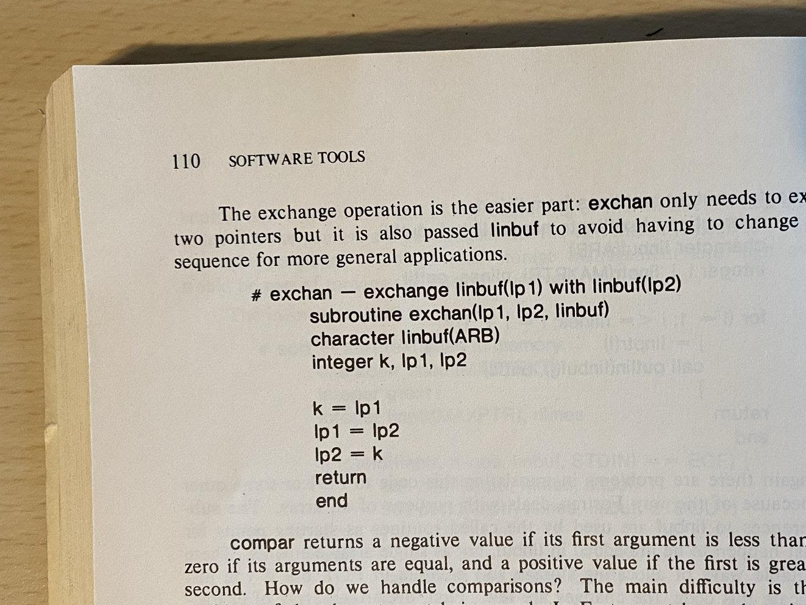
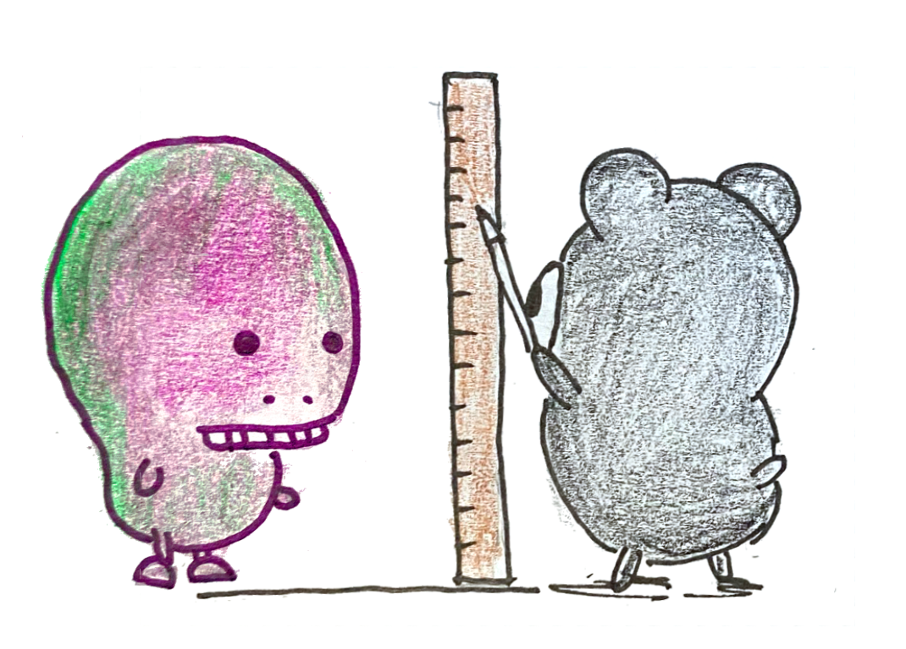
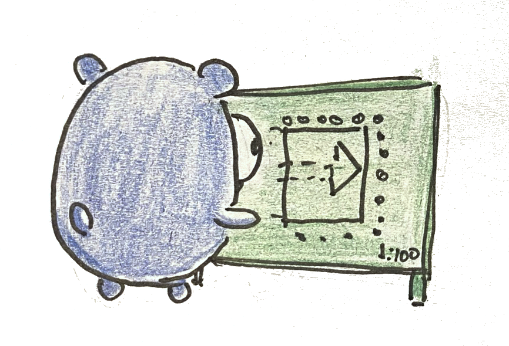
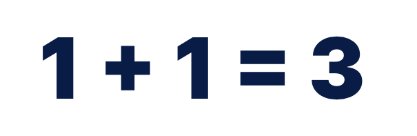
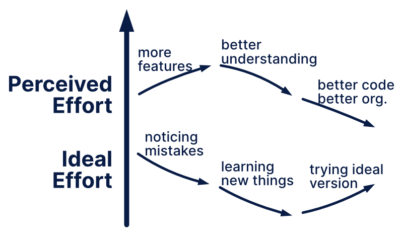
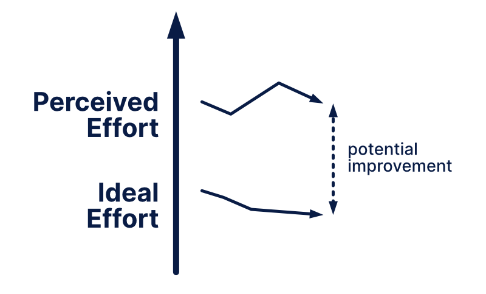
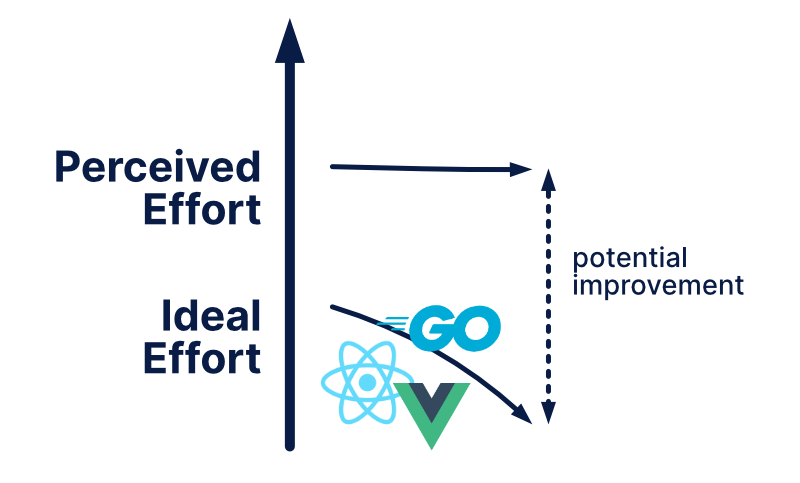
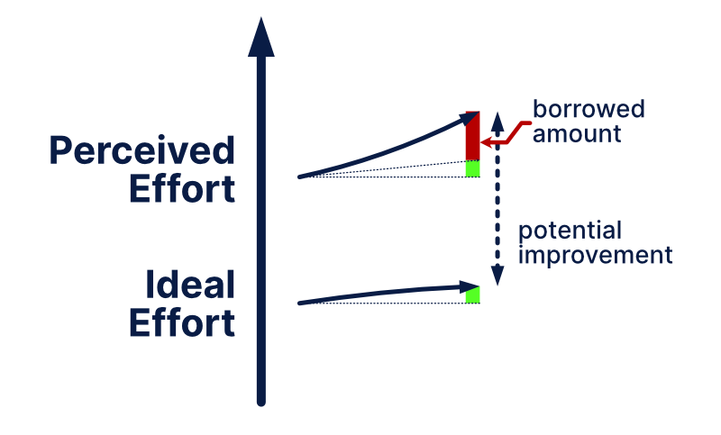
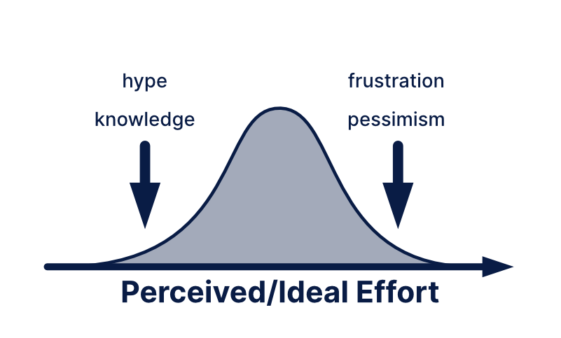

---
author:
  name: Egon Elbre
date: '2021-10-14 00:00:00'
heroimage: ./dea5acde0e869ea5.png
layout: blog
metadata:
  description: "\u200D\u201CTechnical debt\u201D has been bothering me for a while.\
    \ It looks like a scary monster in the closet. It seems somehow a catchall for\
    \ different design mistakes, code worsening over time, legacy codebases, and intentional\
    \ design mistakes due to time constraints. You can take a look at the list of\
    \ caus..."
  title: Demystifying Technical Debt
title: Demystifying Technical Debt

---

‍

  

“Technical debt” has been bothering me for a while. It looks like a scary monster in the closet. It seems somehow a catchall for different design mistakes, code worsening over time, legacy codebases, and intentional design mistakes due to time constraints. You can take a look at the list of causes in [Wikipedia](https://en.wikipedia.org/wiki/Technical_debt#Causes) if you don’t believe me. It makes you feel like the code is collecting dust when it’s not being maintained, but clearly, that cannot be correct since the code might be unchanged.

Let’s take this piece of code from "Software Tools" by Kernighan and Plauger. It has been unchanged since 1976. Has the technical debt risen for this code? When we talk about things collecting dust, the book example would have more chance of being dusty than code stored digitally.

  

To push the metaphor to the breaking point, how do you measure technical debt, and how large is the interest? How much code would I need to write to pay off all the debt? If I have a lot of code, can I give a technical loan to other people?

But I digress; this unclear “technical debt” metaphor has caused bad decisions in codebases that don’t need fixing. On the other hand, not understanding it has caused people to overlook actual problems.

Before we get to tackle ***technical debt***, we need to take a slight detour.

  

# Quality and Effort

The first problem we need to tackle is ***quality***. When we are talking about code quality, we usually have the following things in mind:

* Fit for purpose - whether and how well the code does, what it is supposed to do
* Reliability - does it break every Tuesday between 1 AM - 2 AM;
* Security - can we access, modify or break information that isn’t meant for us;
* Flexibility - how well can the code accommodate new needs;
* Efficiency - how many trees we need to burn to run an operation
* Maintainability - how many hours and lines of code do we need to modify to add, fix or remove a feature.

When we talk about technical debt, usually, we are concerned about maintainability. There definitely are hints of the other aspects in there, but maintainability seems to be dominant.

One way to summarize ***maintainability*** is to treat it as “***effort needed to make a change***.” We can dissect this effort into several pieces or, in other words, places where we use up our energy:

The most visible part is "***effort in code modification***." We can modify many different aspects of the code:

* types, structs, variables, methods - the usual language primitives
* packages, modules - the grouping and organization of code
* tests - things that verify that the code works
* frontend, UX - how things look and how you interact with the system
* documentation - things that describe what the code or program does
* tooling, databases - changes to programs that the code needs to interact
* makefiles, build system - changes in how we run, build the code

By no means is that list exhaustive. The less obvious part of the effort is "***effort in understanding***." Understanding here doesn’t mean only ***understanding*** but clarifying and modifying things that help with understanding. We can dissect it into:

* code structure - how clear is how things interact and how things are connected
* mental model - how we think about the problem and how it relates to the product
* product - how should the product work
* business value - how does the product give value to its users

The last major category is about people. You rarely build a product alone. Even if you are the sole coder and owner of the company, you probably still need to com​​municate with your users. So, there’s "***effort in communication***":

* other developers - asking for help and discussing code design;
* code reviewers - giving and getting feedback on things that can be improved;
* product owners - discussing how the product should work;
* end-users - understanding their needs and where they would get the most value.

We could dive deeper, but the main point is that ***effort*** is not one-dimensional and involves many human factors besides typing code.

# Change in effort

It’s an obvious statement that this ***effort*** changes over time. The question is, how?

***Code modification effort*** roughly depends on a few factors: the amount of code, code complexity, and understanding of the code. Based on these, we can estimate that effort to modify code usually increases because:

* features are usually added -> more code and more things to understand;
* features are rarely removed -> amount of code doesn’t decrease arbitrarily;
* the user interface is larger -> more things that can interact, hence more complexity;
* features accumulate more cases -> which means more complex and more code.

***Understanding effort*** roughly depends on the complexity of the mental model, project, and user needs. It also depends on how much we know the system already. We can similarly estimate that it increases over time:

* larger number of features interact -> more complex mental model and cases to consider;
* more business rules and concerns -> because we want to solve the user problems better;
* knowledge of code, that isn’t being modified is forgotten -> it’s going to be harder to work with a system that you don’t know;
* people come and go -> tacit knowledge is lost when a person leaves.

***Communication effort*** roughly depends on the number of people you need to communicate with and clarity on organization structure. Here it’s harder to pinpoint clear tendencies, but we can estimate that:

* communication effort increases when a company grows
* communication effort decreases when processes and company structure is clarified

Overall, we can estimate that:

***The effort to maintain a project increases without activities that actively reduce it.***

It would be easy to conclude that this “***increase in the effort***” is the “***technical debt***.” However, when we look back at the initial question about old code.

This code has been years in a book without any new additions and no one communicating about it, but some still consider it technical debt.

There must be things that we don’t take into account when thinking about technical debt.

# Mistakes everywhere

One of the fundamental laws of software development is that you make mistakes. Technical debt is often associated with bad decisions in the past. Let’s get philosophical – how do we recognize mistakes?

  

When we look at this equation, we have two parts in our head:

* The perception of the equation.
* The expectation of the equation and what it should be.

Or in other words, there’s something that we ***perceive*** and realize that it’s not in its ***ideal*** state. The more significant this difference between our perception and expectation, the larger the mistake seems.

We can apply the same line of thinking to ***effort*** and ***maintainability***.

Our ***ideal effort to modify*** decreases when we learn how things could be better. So, there’s a “potential improvement” that we evaluate. We could simplify this into an equation:

**Technical Debt ~ Perceived Effort - Ideal Effort**

There are several interesting observations here.

When there’s a breakthrough in technology, people realize that there’s a much better way to do something. Hence, they feel that their project has technical debt and they should fix it. Although, the effort to maintain the project hasn’t changed. Only the expectation has changed. In principle, the technical debt is higher because people learned something new. *Note, that our "ideal" may have many problems that are being overlooked*.

Borrowing technical debt is also nicely explained with this way of thinking. Instead of perceived effort and ideal effort changing separately, they are changed together. Or in other words, we increase perceived effort while knowing that ideal effort would increase it less.

  

This model does seem to explain technical debt quite well and gives us a nice intuition about different situations.

As a side note, it is interesting to consider ***quality debt*** or ***security debt***. However, it’s essential to realize that improving ***quality*** can sometimes increase effort to maintain the software. For example, writing code is much easier if you don’t care about security or performance.

# Pobody’s Nerfect

It might seem that “***perceived effort***” and “***ideal effort***” are easy to measure, but they have many dimensions. Similarly, different people may come to different conclusions.

The first question is, whose effort? – if we measure “hours spent on a change,” then different people have different speeds. We could consider the “average developer in the world,” or “average developer in the company,” or “the average junior developer,” or “average game developer.” Additionally, people have different skills and knowledge in different areas.

The second question is, which changes? Is it about an arbitrary change in the codebase or the most common change or architectural changes? All of these are different, and some are more likely than others.

Finally, we need to consider the person evaluating because every person has some biases. Especially when dealing with “***perceived effort***” and “***ideal effort***.”

  

For example, if the person is hyped about a language, framework, or works with a system they know well, they can easily underestimate the average effort. This is due to knowing how to solve common problems and knowing how to avoid the issues in the first place.

On the other hand, if the person has a strong preference for other tools, the tools have a flaky behavior, or the person doesn’t understand the system, they can overestimate the effort needed to maintain a system. For example, flaky tests that fail once a month are annoying; however, realistically, it doesn’t affect the effort to maintain too much.

We tend to overestimate the effort needed to maintain code written in old languages. Definitely, there is more effort required to maintain old code, but it’s not as big as it might seem. Think about how people learn a new JavaScript framework and library every week and keep up with it. If you can learn new code, you can learn old code.

We also tend to overestimate the effort needed to use another language with different features. A C++ programmer starting to use Go would feel overly restricted and hence conclude that they will be significantly slower when writing. Similarly, a Go programmer thinks they would be overwhelmed when starting to use Rust due to the number of available features. Both are right to some degree, but the main reason for feeling the “speed of writing difference” is not knowing how to use the language effectively. After a few months of using a language, the unfamiliarity will decrease. There are definitely differences in languages and their usability, but it’s not as big as it seems at first sight. Nevertheless, there would still be a bias towards the language and community you like more.

Interestingly there’s no such feeling when taking a language with an unfamiliar paradigm. In such cases, we accept our ignorance much more quickly.

Beginner programmers seem to overestimate the “ideal effort” for newer frameworks because it might look like they solve all the problems. Veteran programmers are either realistic or pessimistic because they have been burnt before and know that most problems don’t lie in the framework but elsewhere.

Overall we can state that the less familiar you are with a codebase, system, tool, the higher your bias can be. The bias can be either positive or negative.

# Technical Debt by Ward Cunningham

Initially, when Ward Cunningham came up with the metaphor, he only had the “code mismatching business ideas” in mind. He was more precise in its formulation than people know.

*And that said that if we failed to make our program align with what we then understood to be the proper way to think about our financial objects, then we were gonna continually stumble over that disagreement and that would slow us down which was like paying interest on a loan.*

* *Ward Cunningham (*[*https://www.youtube.com/watch?v=pqeJFYwnkjE,*](https://www.youtube.com/watch?v=pqeJFYwnkjE,)[*http://wiki.c2.com/?WardExplainsDebtMetaphor*](http://wiki.c2.com/?WardExplainsDebtMetaphor)*)*

In other words, we improve our “ideal mental model of the system,” and there’s a difference between our code and the ideal mental model. There was no concept of “borrowing,” and that would’ve been an error while developing.

# What can you do about it?

After all of this discussion, you might wonder how you deal with technical debt.

## Rewrite???

The first inclination for people to get rid of “technical debt” is to rewrite the system. Rewriting carries considerable risk, and the larger the piece you are rewriting, the larger the chance of failure.

Few factors contribute to rewriting ending up in a failure:

* People don’t notice things that work well in the current system due to desensitization. During rewriting, it’s easy to forget that they should keep working well. These parts are also often more important than the things that currently don’t work well.
* *Note, people also get desensitized to things that work poorly consistently. For example, when some process always takes 10 min, it doesn't bother people; however, when it takes 10 min randomly, it does.*
* Size of the refactoring. Each line of code you change can introduce a bug; hence, the more lines and more systems the piece of code integrates, the more likely it is to have faults.
* People focus on fixing the mistakes, sometimes at the cost of the rest of the system. One aspect of this is the “second-system effect,” where you end up overcomplicating the system by including all the missing features.
* Unclear understanding of how the current system exactly works. It’s pretty common that people want to rewrite a system because they don’t understand it.

Overall, a [rewrite should be the last resort](https://www.joelonsoftware.com/2000/04/06/things-you-should-never-do-part-i/), and try to minimize the problems above to ensure that the rewrite ends up as a success. Before rewriting, you also should be able to give an estimate (in numbers) on how much the rewrite would help.

Prefer refactoring over rewriting and see "Working Effectively with Legacy Code" by Michael C. Feathers for more recommendations.

## Continuous Learning

One good way to prevent “technical debt” is to ensure that the developers have a scheduled time to learn about coding and the business. The more the developers know how to do things, the fewer surprises they get about their system. There are many ways to implement these in a company - 20% projects, hack weeks, book clubs, regular presentations by other people.

Try to implement one feature in multiple ways. The more ways you know how to solve a problem, the more informed your decision will be.

Finally, a good strategy is to ask for help and guidance. There are plenty of experienced programmers that can do a review of your code and suggest improvements.

When we learn new things, it’ll actually end up increasing “technical debt” because it lowers the “ideal effort,”… but it will also mean that programmers are more likely to write code that is nearer to that “ideal effort.”

  

## Code Reviews

Code reviews significantly help disseminate understanding about the system and learn early about things that could be better.

First, automate linting as much as possible and automate formatting. Ideally, when someone starts to review the code, all the style questions have already been solved. The style questions can grab attention quite fast.

One target for every developer is to ensure your next pull request quality is better than the last one. By trying to improve the quality of every PR, people end up defaulting to a better baseline. There are many ways to define better; ideally, try to improve in multiple dimensions.

Strive for gradual improvement of the codebase rather than large improvements. As mentioned previously, the larger the change, the more likely it is to contain mistakes.

Ideally, target less than 400 LOC per change. When the change is over 400 LOC, the reviewer fatigue kicks in, and reviewers start missing more bugs. Similarly, when commits are small, they get merged faster and are less likely to go stale. [See this SmartBear study for more information](https://smartbear.com/learn/code-review/best-practices-for-peer-code-review/).

While reviewing, always consider whether two similar commits would make it difficult to maintain? If yes, then the next PR should be preceded by an improvement to the structure.

## Maintenance

It’s easy to lose sight of the overall picture when implementing things one at a time. Hence, do regular architecture reviews. Think about whether everything feels right. Note down places where people waste their effort and discuss how you can improve these parts.

As programmers, the first inclination is to fix “maintenance effort” with fixing the code; there sometimes can be alternative means. For example, a good video explaining how the existing “bad system” works and why things ended up that way can be much less effort and have more impact.

For maintenance, it’s helpful to isolate problem areas. Some third-party packages and libraries are pervasive and can seriously affect the rest of the codebase. By creating a nice wrapper for those systems, they can be made less benign.

## Acceptance

The final advice is about acceptance:

*“Not all of a large system will be well designed…”*

* *Eric Evans*

While the inclination is to try to fix all the problems you notice, it might not make a significant difference to the needed effort to maintain the system. You don’t have to rewrite your bash scripts in Haskell for the glory of purity. Your time to implement things is limited and try to figure out how you can make the most impact on the value stream.

# Conclusion

Technical debt is not “dust” that accumulates on your code, but rather it’s an inherent part of code. Over time you learn and notice mistakes in your systems. Using “technical debt accumulates” is the wrong mentality; instead, it should be considered “discovering technical debt.”

**Technical Debt is not a Monster.**

**It’s just the realization that you could do better.**

  
  

