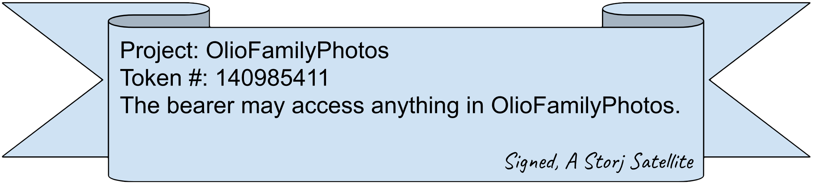
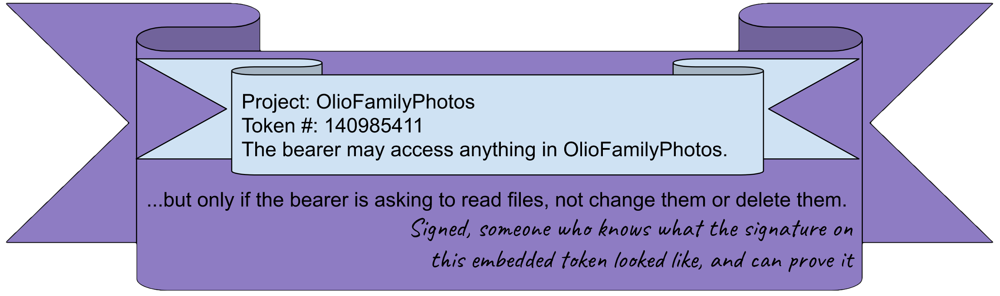
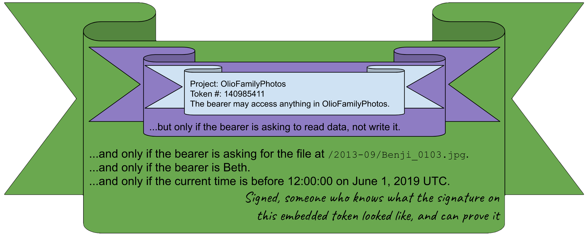

---
author:
  name: Paul Cannon
date: '2019-05-03 00:00:00'
heroimage: ./71499072b0db295f.jpeg
layout: blog
metadata:
  description: Sharing is a vital piece of any online storage system. Or, to be more
    precise, access control is a vital piece of such systems. When you store a file,
    you need to be able to designate whether other people or automated agents are
    allowed to retrieve the data, delete it, or put something else in it...
  title: Flexible File Sharing With Macaroons
title: Flexible File Sharing With Macaroons

---

Sharing is a vital piece of any online storage system. Or, to be more precise, access control is a vital piece of such systems. When you store a file, you need to be able to designate whether other people or automated agents are allowed to retrieve the data, delete it, or put something else in its place. On top of that, you also need to be able to designate when and for how long that particular access should be allowed. We can refer to this as “sharing” because that is typically how we make direct use of access control in our everyday online lives. You might have shared a Google Docs spreadsheet with a team of people or allowed a friend to download a particular video file from your Dropbox account. Often, this type of sharing involves sending around a unique URL. 

The Storj platform, of course, requires this type of functionality. Some people will be using Storj as personal backup, and won’t want or need anyone else to have access to their stuff. Some will use the platform to store collections of family photos, and they will want to allow friends and family to view the albums (but not add to them or change them). Some will use Storj for business collaboration, and share a large folder with members of a team as though it were a network share. Finally, some will use Storj as a CDN, and will want to allow anyone and everyone to download their content. Storj intends to support all these use cases and many more.

The mechanism we are building to accomplish all of this uses a special type of bearer credential called a Macaroon. Macaroons can be thought of as “enhanced [browser] cookies”, and that’s why they got the delicious name. They were an idea that originated from Google research¹ a few years ago. Macaroons have the special quality that the user can derive new, more restricted macaroons from them, without any involvement on the part of the service they are targeting. This is useful to us for two chief reasons. First, because macaroons encode all the necessary information about what they grant, Storj Satellites do not need to maintain their own (potentially enormous) list of all shares ever made, including what resources are included, with whom they are shared, and under what conditions access should be allowed. Instead, the Satellites only² need to keep track of one root token per project. Any derived Macaroons that are sent to the Satellite can be parsed and verified when received. The second reason is that this mechanism allows third-party developers a significant amount of power and flexibility, without requiring the development of a powerful and complicated API, along with all the costs and complexity and potential vulnerabilities that would entail.

Let’s see how they work!

Suppose you create a new project instance on the Storj network called “OlioFamilyPhotos”. The Satellite you are using gives you a token that will govern access to that project. We can think of it looking like a certificate like this:

Any time you ask your computer to read or write files in OlioFamilyPhotos, it can send that special certificate to the Storj Satellite to prove that it’s allowed to do so. The Satellite will verify the digital signature and grant access if appropriate. You could make a copy of the certificate and share it with your spouse, if you trust them with full, unrestricted access to the project.

But you may want to allow other family members to see these photos, without being able to reorganize or delete anything (they really are busybodies sometimes). Rather than making API calls to the Storj Satellite to ask for a new token, you³ can make a copy of your existing token, cut off the signature, paste it into a bigger certificate, and add on a proviso, like this:

You can hand out copies of this bigger certificate to family members at the next family reunion. If they want to see your photos, their computers will send this bigger certificate to the Satellite. The Satellite can still verify the digital signature—through the wonders of digital cryptography⁴—and thereby verify that the added proviso is satisfied. If your second cousin-in-law turns out to be nefarious and wants to make changes to your photos, they can’t just cut out the smaller certificate from the big one and use that, because its signature is gone. They could try to make a new bigger certificate with a weaker proviso, but they would not be able to make a valid signature because they don’t know what the original signature looked like.

Now, imagine Aunt Alice wants to share a specific one of your photos with her friend Beth. Alice values your privacy and does not want to share everything with Beth, and she also does not want Beth to be able to share the photo with anyone else. Just like what we did earlier, Alice can make a copy of her certificate, cut off the signature, paste it into a bigger certificate, and add on some provisos:

 

Again, the Satellite will be able to verify this digital signature, verify that the signer knew what the signature on the intermediate certificate looked like, verify that the intermediate signature was also valid, and check that all the provisos there are satisfied before granting access. There won’t be any way for Beth to use the original root project token or the intermediate family-sharing token on their own; she will only be able to use this certificate to fetch that one specific file, and nothing else. She also won’t be able to pass on her access to anyone else, because of the “only if the bearer is Beth” proviso that has been indelibly added.

This chain can be continued for many more steps, allowing Macaroons of significant complexity where necessary.

We expect to bring you access control by way of Macaroons in one of the next few Alpha releases. Stay tuned for more details!
