---
author:
  name: Tim Parth
date: '2020-09-09 00:00:00'
heroimage: ./75e382c46a1d2f4e.jpeg
layout: blog
metadata:
  description: "In this blog post I will share an overview of how I built the native\
    \ Tardigrade integration for Duplicati. This is also a good introduction on how\
    \ to build a new back end for Duplicati\u2014although I do not know why there\
    \ should be the need for another back end next to Tardigrade. \U0001F60AFor those\
    \ who do n..."
  title: Integrating Decentralized Cloud Storage with Duplicati
title: Integrating Decentralized Cloud Storage with Duplicati

---

In this blog post I will share an overview of how I built the native Tardigrade integration for Duplicati. This is also a good introduction on how to build a new back end for Duplicati—although I do not know why there should be the need for another back end next to Tardigrade. 😊

For those who do not know what Duplicati is: it is one of the biggest open-source and free back up utilities out there which has plenty of "back ends" to connect to, which will hold the archived data for you. Duplicati has its own logic for organizing files and metadata, but basically completely relies on files with a fixed size. This perfectly fits the Storj Labs Tardigrade cloud storage service, as it works best with (although is not limited to) big files that don't change often.

We have had Duplicati support for a long time through the tool's S3-gateway, which is still a valid way to go. But this involves installing and configuring the gateway locally which is not the best for the average "just want my backups done"-user. Therefore, we decided to go the native way and to create a Duplicati back end that "simply works" without installing anything else except Duplicati.

Getting cold feet and fearing of data-loss? Go and start your backup to Tardigrade via Duplicati [here](https://documentation.tardigrade.io/how-tos/backup-with-duplicati).\Getting hot on how all this works internally? Read on. 😊

### Where to start

Duplicati itself is available on GitHub for anyone to clone, fork, extend and fix. So, in order to start developing for it, clone the actual Duplicati-repository locally. I am doing this on Windows, but Linux and Mac are supported, too. Just click the "Code" Button on the GitHub-Repo [here](https://github.com/duplicati/duplicati) and choose the option that fits your developer setup. Personally I'm working with GitHub Desktop, which I find very helpful with the daily git-tasks.

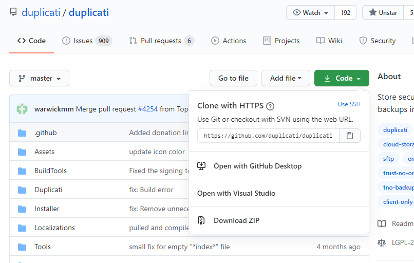Next, open the Duplicati solution with Visual Studio. You will find plenty of projects included. First, try to build and run Duplicati to see if something is missing. Right-click the "Duplicati.GUI.TryIcon" project and set it as start project. Hit F5 and if everything is ok the tray icon should launch from where you can enter the frontend in your browser. Further info on setting up your Duplicati development can be found [here](https://github.com/duplicati/duplicati/wiki/How-to-build-from-source).

### Let's do this

If you want to create a new back end, you would have to create a new project within the solution and place it in the namespace (and path) such as “Duplicati.Library.Backend.XXX“. This newly created project then has to be added as reference to “Duplicati.GUI.TrayIcon“, “Duplicati.CommandLine“, “Duplicati.CommandLine.BackendTester“ and “Duplicati.Server“. This assures your project can be used from all relevant parts of Duplicati.  
Going forward, we’ll focus on the Tardigrade-Backend which—following the convention—can be found under “Duplicati.Library.Backend.Tardigrade“:

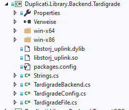The first file created and the most important one is “TardigradeBackend.cs“. It contains the main logic of the back end. To get a valid back end, a class has to implement either the "IBackend“ or the "IStreamingBackend“-interface. As Storj supports async streams the Tardigrade back end implements the latter.

The most important methods you have to implement for a back end to work correctly are "Put“, "Get“, "List“ and "Delete“. But by simply adding one of the two interfaces to the class makes your back end already visible to Duplicati. It then already gets added to the list of possible backup-targets, but to be really useful you would have to return values for the properties "DisplayName“ and "ProtocolKey“. The former gives your back end a name, the latter is a prefix used by Duplicati to know which configuration belongs to which back end. You might also want to provide a Description for your back end by returning a value within the "Description“ property, as the name suggests.

"Sprechen Sie deutsch?“

A word about localization: Duplicati is available in 43 languages currently. This is done by extracting the strings to Transifex for translation by the community. The translated texts then get automatically fetched for the current user-language. All you must do is to make sure that all your strings are routed through Duplicati.Library.Localization.Short.LC.L(). Recommended approach is to extract those strings into a static class named like the back end as seen here:

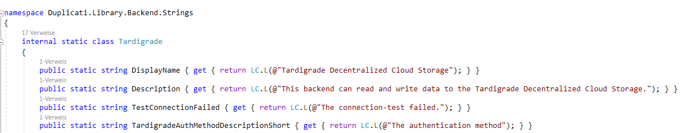Then use those static strings whenever you need to return a translatable string to the user.

### Connect to Storj

The native integration of Storj and the Tardigrade-network is done with the uplink.NET-library, which is a .Net-Wrapper around the uplink-c-library. Basically, this library includes compiled binaries for Windows, Mac, Linux, iOS and Android and calls into them by a technique called P/Invoke. Those native calls into the platform binaries (compiled from Go to C – you are still with me?) are wrapped in a way that .Net-developers should feel comfortable with. More information on the uplink.NET-library can be found [here](https://github.com/TopperDEL/uplink.net) and the corresponding NuGet is [here](https://www.nuget.org/packages/uplink.NET).

Let us have a look at the Put-Method, which uploads a file to the back end. It provides us with a stream to a temporary file and where it should be placed at the remote location. We simply handle that Stream over to UploadObjectAsync() of the ObjectService from the uplink.NET-Library:

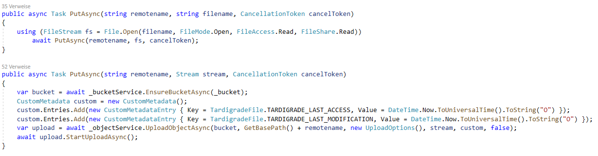Additionally we are setting some custom metadata for the LastAccess and the LastModification. This metadata is later retrieved again from the file during listing and helps Duplicati verify and handle the files.

Downloading a file is done in a similar way–we get a stream where the file-data should be written to and the filename on the remote location. Here we are using the DownloadOperationProgressChanged-event to fill the stream with the newly received data:

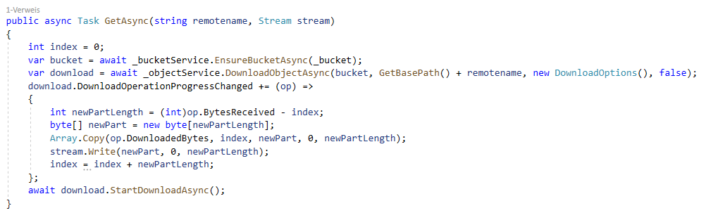Listing files on the remote location is necessary for Duplicati to verify if an expected file is available and to successfully restore data without having any knowledge about the backup. We list all files within the bucket (and possibly within a folder) recursively and include the CustomMetadata ("Custom = true“).

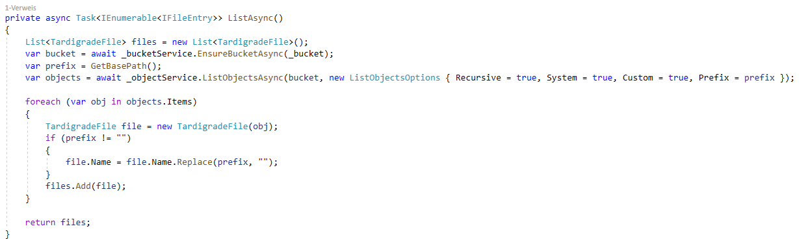For that method we needed an IFileEntry-Implementation – therefore I created a "Tardigrade file“ which fetches its properties (size, name, etc.) from the underlying Storj-object (see TardigradeFile.cs).

Finally let’s have a look at the Delete-Method, that’s really straight-forward:

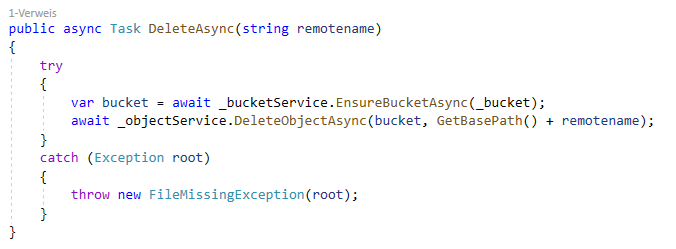To have valid access to a Storj-bucket and the included objects, we need some information from the user. Without defining the user-interface for a back end, Duplicati defaults to some generic fields. To really be useful, we need a more Tardigrade-specific UI. I will come to that in a second – let’s just quickly see how we handle those options within our Tardigrade back end. We get them within the constructor of our back end as a collection of KeyValue-Pairs, so all we must do is read and use them.

With Tardigrade, the user has multiple ways to get access:

1. The user can provide a so called "access grant“. That grant already includes all the information necessary to connect to the Storj-network. It contains the Satellite to use, the API key for the project, the encryption passphrase, and possibly some restrictions to only have access to specific buckets and/or prefixes.
2. The second way is by providing that information manually–so the user might want to enter a Satellite address, an API key, and the encryption passphrase on his own. For convenience, the user can select from available Tardigrade-Satellites or enter a Satellite address manually.

Besides the rough connection settings, the user has to provide a bucket name to use and may optionally provide a "folder“ within the bucket where a specific backup will reside. Technically this will convert into a prefix. 

With all that information coming from the user-interface it is quite simple—though a little verbose—to create the necessary uplink.NET-objects in the TardigradeBackend-constructor:

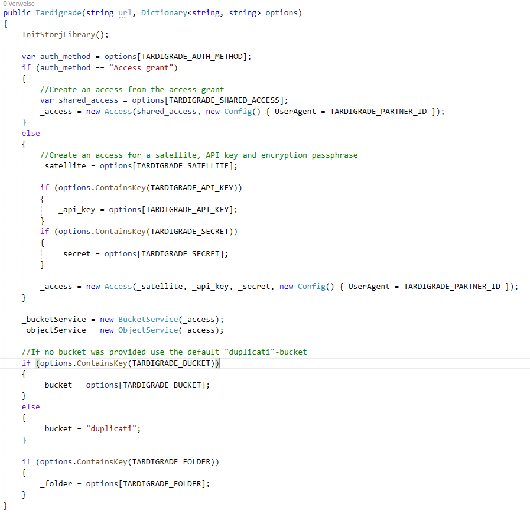### Facing the user

To implement a Tardigrade-specific user interface, we must leave Visual Studio and create some additional files. In the subfolder "Duplicati/Server/webroot/ngax/templates/backends/“ I created a new file called "tardigrade.html“. To let Duplicati actually use that file, we need to supply that template-file to a JavaScript-list. This happens in the file "Duplicati/Server/webroot/ngax/scripts/services/EditUriBuiltins.js“:

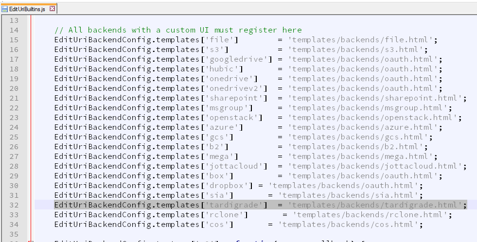In the template-file we can now define the view shown when the user selects our back end from the list of available back ends.

This is the view I’ve created for the Tardigrade-back end:

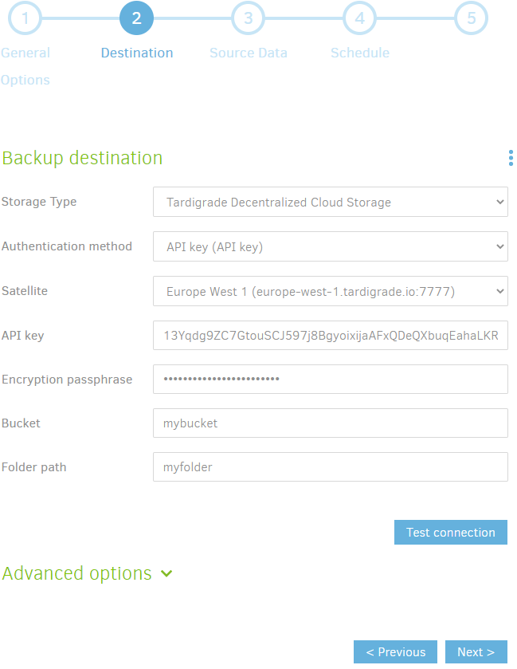I will not go into the details on how to create this. But I want to emphasize some things around it that help in generating nice and productive back end-views. E.g. the available Satellites in the dropdown can be provided by your back end. For this to work you must provide a class that implements the IWebModule-Interface. The Execute-Method can then be called by some JavaScript on the UI. This may happen on loading the UI like this (also in the “EditUriBuiltins.js“):

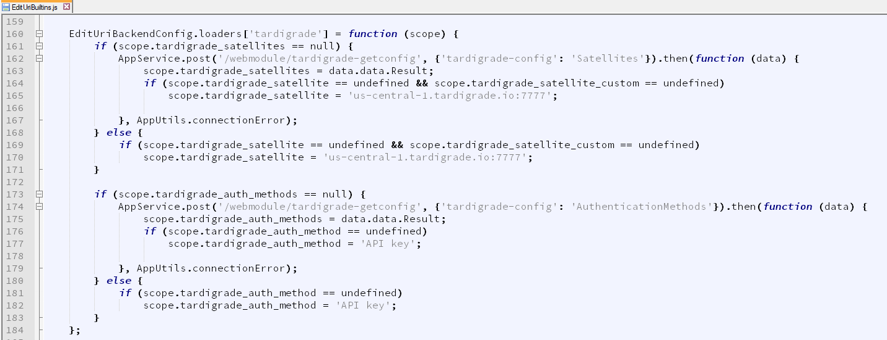In line 162 you can see the call into the WebModule for Tardigrade asking for all the available Satellites. Following that we also set the default values to use if they are not yet set.

To get our options from the UI into the options that Duplicati sends to our back end, we need to map the values like this:

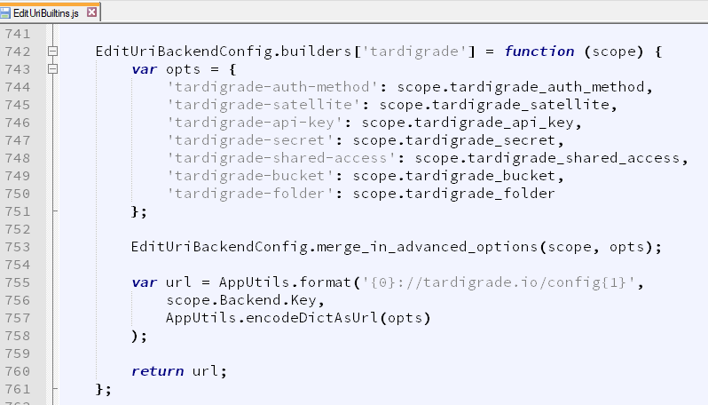Now we have a clean and easy to use UI for the users of our back end, that fetches some values from the WebModule and provides all selected options to our back end.

### Summary

Creating a native Duplicati-back end to connect to the Tardigrade-network was not that difficult if you know where to adjust things. The back end itself could be added easily as the relevant interfaces fit nicely with the overall logic of Storj. The uplink.NET-wrapper handles the connection on all the supported platforms (Windows, Linux, MacOS) so that nearly worked out of the box. Defining a UI to get the exact parameters necessary for Tardigrade involved a bit of HTML and JavaScript, but that also was implemented quite easily.

We now have a native Duplicati-back end for Tardigrade/Storj, that anyone can use to backup private data to the cheap, fast, decentralized and secure cloud storage! Go and try yourself! 

  

