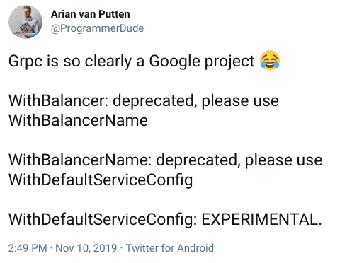

---
author:
  name: JT Olio and Jeff Wending
date: '2021-04-27 00:00:00'
heroimage: ./e2c929baac38fe20.png
layout: blog
metadata:
  description: In 2016, Google launched gRPC, which has overall taken the systems
    programming community by storm. gRPC stands for something with a G, Remote Procedure
    Call; it's a mechanism for easily defining interfaces between two different remote
    services. Building a new decentralized storage platform from the ground up in
    Go, obviously, we considered using gRPC to simplify our development process in
    peer-to-peer remote procedure calling. In fact, I'm not even sure we really considered
    anything else. Fast forward to the latter half of 2019, and we had 170k lines
    of Go, a beta network of over 4 PB, real live active users, and it turns out the
    gRPC bed we made for ourselves was not all roses. So we rewrote gRPC and migrated
    our live network. DRPC is an open-source, drop-in replacement that handles everything
    we needed from gRPC (and most likely, everything you need) in under 3000 lines
    of Go. It now powers our full network of tens of thousands of servers and countless
    clients.
  title: 'Introducing DRPC: Our Replacement for gRPC'
title: 'Introducing DRPC: Our Replacement for gRPC'

---

In 2016, Google launched [gRPC](https://grpc.io/), which has overall taken the systems programming community by storm. gRPC stands for something with a G, Remote Procedure Call; it's a mechanism for easily defining interfaces between two different remote services. It's tightly bundled with [Protocol Buffers](https://developers.google.com/protocol-buffers) version 3 (another highly adopted data interchange specification from Google), and... it seems like everyone is using it. Wikipedia, Square, Netflix, IBM, Docker, Cockroach Labs, Cisco, Spotify, Dropbox, etc., all use gRPC.  

Here at Storj, we’re pioneers in decentralized cloud storage. By early 2018, we built and scaled a 150 petabyte decentralized storage network. Of course, like every good scaling story, by the time we got to 150 petabytes, we discovered some fundamental architectural issues that needed to be reworked. Staring down the barrel of a few hundred thousand lines of untyped Javascript with... sort of decent test coverage, we made the [risky decision](https://www.joelonsoftware.com/2000/04/06/things-you-should-never-do-part-i/) in March of 2018 to fix these architectural issues with a ground-up reimplementation in Go. We're calling this iteration our V3 network, which had its production launch in March of 2020. You can read all about our architecture in [our whitepaper](https://storj.io/storjv3.pdf), and you can [try out our live service](https://www.storj.io/).  

*(Aside:* [*We’re hiring engineers!*](https://storj.io/careers/)*)*‍

Building a new decentralized storage platform from the ground up in Go, obviously, we considered using gRPC to simplify our development process in peer-to-peer remote procedure calling. In fact, I'm not even sure we really considered anything else. Using gRPC for us was a deliberate decision to [avoid using an innovation token](https://mcfunley.com/choose-boring-technology). How could gRPC be the wrong choice? It has impressive credentials and wide usage. We were always disappointed Google didn't release a standard RPC implementation with proto2. With an otherwise previously strongly positive experience with protocol buffers, we were excited to jump all in to the new protobuf RPC land.

Fast forward to the latter half of 2019, and we had 170k lines of Go, a beta network of over 4 PB, real live active users, and it turns out the gRPC bed we made for ourselves was not all roses, and we kind of pooped just a little in it. Just a little bit. This much ->||<-. So not a lot, but still.

So we rewrote gRPC and migrated our live network. [DRPC](https://storj.github.io/drpc/) is an open-source, drop-in replacement that handles everything we needed from gRPC (and most likely, everything you need) in under 3000 lines of Go. It now powers our full network of tens of thousands of servers and countless clients.  

[Check out DRPC here!](https://storj.github.io/drpc/)

# Where gRPC needs improvement

Let’s just get out here and say what not enough people are saying—in a nutshell, gRPC has feature creep, bloat and is trying to solve too many problems. It’s overcomplicated and has become a dumping ground of features, tangled in a standards body-based web of crap. 

Let’s go over the problems with gRPC one by one!  

## Feature bloat

Did you know that there are 40 different dial options? There are 26 server options. You have 13 call options. gRPC is huge. One major issue that led us away from gRPC was that it constituted over a fifth of our own (sizeable) binaries.

Do you use gRPC’s built-in APIs for internal load balancing? You probably don’t—your load balancer probably does something else. Do you use manual name resolution builders? Do you find yourself uncertain what operations are synchronous or not? Wait, should we use WithBlock? gRPC tends to accrue features so that it tries to solve every problem, and with every solution comes more code to maintain, places for bugs to hide, and additional semantics to worry about.

On the other hand, DRPC’s core is under 3000 lines! It’s a reasonable task to audit and understand it.  

## Deprecation

  

<https://twitter.com/ProgrammerDude/status/1193646924227854337>‍

This tweet is from 2019, and as of today, in 2021, WithDefaultServiceConfig is still experimental, and WithBalancerName is still deprecated.

At the time of this writing, there are 37 deprecation notices in the top-level [gRPC documentation](https://pkg.go.dev/google.golang.org/grpc). This makes it hard to understand what you’re supposed to use, what you’re not supposed to use, what things are available, etc.  

## High resource usage

81% of the heap usage of one of our Storage Nodes was in gRPC. You can’t use another protobuf library; there are a large number of allocations, you get its own HTTP/2 server, and the hits keep coming.   

A protobuf-based protocol has the fortunate ability to avoid a complicated string parsing and overhead of traditional, older protocols, such as HTTP, unless you use gRPC. Then you have to deal with HTTP/2 and all the legacy edge cases that may arise.   

## Opacity

Pop quiz: imagine you’re trying to debug some issue that’s happening during dialing of connections, and you use <https://pkg.go.dev/google.golang.org/grpc#WithContextDialer>. See if you can find where in the gRPC code base the function you provide there is called.  

gRPC is at least 10 times more lines of code than DRPC, and it is safe to say some of the API has grown organically and is hard to reason about.  

DRPC, meanwhile, is implemented to be lightweight, straightforward, clear, and easy to debug.  

# Wait, but a rewrite?

Yep! Considering we have 170k lines of Go, tightly integrated into both single and streaming request styles of gRPC, in 2019, we narrowed our options down to:  

* [Thrift](https://thrift.apache.org/)
* [Twirp](https://github.com/twitchtv/twirp)
* Fork gRPC?
* Write our own

We really wanted to avoid having to change every service already registered with gRPC. Again, the services were fine, and we just needed to change the connection layer. Thrift was a pretty big departure for pretty much all of our code, so we eliminated it. Maybe it would have been good to start with, but we judged by the cover and suspected it wasn’t the best place to start.  

We could have eliminated Twirp for the same reason, but Twirp had another problem - we needed support for bidirectional streaming, and Twirp didn’t have it.  

Forking gRPC may have been a good choice, but we would suddenly be responsible for all of it, as we ripped out the parts we didn’t need. Ripping out the overhead of HTTP/2 alone was by itself essentially a rewrite. It seemed like a simpler undertaking to start fresh.  

So, we decided to time-box an experiment to write our own. The experiment was a smashing success.

# DRPC

[DRPC](https://storj.github.io/drpc/) is a code-wise drop-in replacement for the client/server interactions of gRPC. If you’re using gRPC today in Go, you should be able to swap your protocol buffer generation pipeline to DRPC and be on your way. If you already have proto3 .proto files, the protoc protobuf compiler can be told to generate DRPC code instead of gRPC code (or both, if you're migrating).

DRPC supports a wide range of functionality in its spartan few thousand lines. DRPC is blazingly fast and lightweight (the protocol does not require HTTP header parsing, for example), it supports unitary and streaming requests, it has an HTTP/JSON gateway, it supports metadata for per-request side-channel information like tracing, it supports layering and middleware, etc.

[Check out how easy our Quickstart documentation is!](https://storj.github.io/drpc/docs.html)

Also be sure to check out the gRPC vs DRPC benchmarks on [our Github README](https://github.com/storj/drpc#readme). I want to specifically call out how much better with memory usage DRPC is. GC pressure sucks! When you have high performance servers, reducing GC pressure is always a good call.

Also make sure to see more examples at <https://github.com/storj/drpc/tree/main/examples> 

It's worth pointing out that DRPC is *not* the same protocol as gRPC, and DRPC clients cannot speak to gRPC servers and vice versa.

# Migration

One major challenge we faced was that we already had gRPC deployed. We needed to support both DRPC and gRPC clients for a transition period until everything understood DRPC.  

As a result, we wrote (and included in DRPC) migration helpers that allow you to listen for and respond to DRPC and gRPC requests on the same port. Make sure to check out <https://pkg.go.dev/storj.io/drpc/drpcmigrate#ListenMux> and our gRPC and DRPC example: <https://github.com/storj/drpc/tree/main/examples/grpc_and_drpc>  

Here were our transition steps:  

1. Release and deploy new server code that understands both gRPC and DRPC concurrently. With DRPC, this was a breeze since all of our application code could be used identically with both, and our ListenMux allowed us to do both from the same server port.
2. Once all the servers and Nodes were updated, release and deploy new clients that spoke DRPC instead of gRPC.
3. Once all of the old clients were gone, we removed the gRPC code.

We immediately eliminated a whole class of inscrutable WAN network errors (our availability metrics went up), improved performance and reduced CPU and resource utilization, reduced our binary sizes significantly, and have overall been much, much happier.

# We're open source

DRPC, like almost everything else at Storj, is open source. DRPC is MIT/expat licensed, and we’d love your help! Since we currently only have Go bindings for DRPC, bindings for new languages would be a great place to start.

Feel free to check out [our Github repo](https://github.com/storj/drpc) and let us know if we can help you dive in!  

