---
author:
  name: Egon Elbre
date: '2022-07-18 00:00:00'
heroimage: ./e1ce73a8dfceabfd.jpeg
layout: blog
metadata:
  description: "I couldn\u2019t find a great tool for viewing disassembly, so I wrote\
    \ it myself over the weekend."
  title: Lensm, A Tool for Viewing Disassembly
title: Lensm, A Tool for Viewing Disassembly

---

I couldn’t find a great tool for viewing disassembly, so I [wrote it myself over the weekend](https://github.com/loov/lensm).

At Storj, we are constantly looking for ways to accelerate our team’s efficiency, and one of those is building the tools we need.

One of the major things you will rub against when you delve into performance optimization is viewing the assembly that the compiler generates. It's usually not efficient to write assembly yourself, and it's better to try to coerce the compiler to produce the assembly you want. Here's my story of writing a little tool for viewing disassembly.

# Getting Annoyed

My story starts on a weekend when I was doing a bunch of tiny optimizations to the [Gio UI](https://gioui.org/) project. There are ways to view the assembly; one is to use **go tool objdump -s funcname** from the command line. However, it's rather difficult to see how the source code and assembly are related.

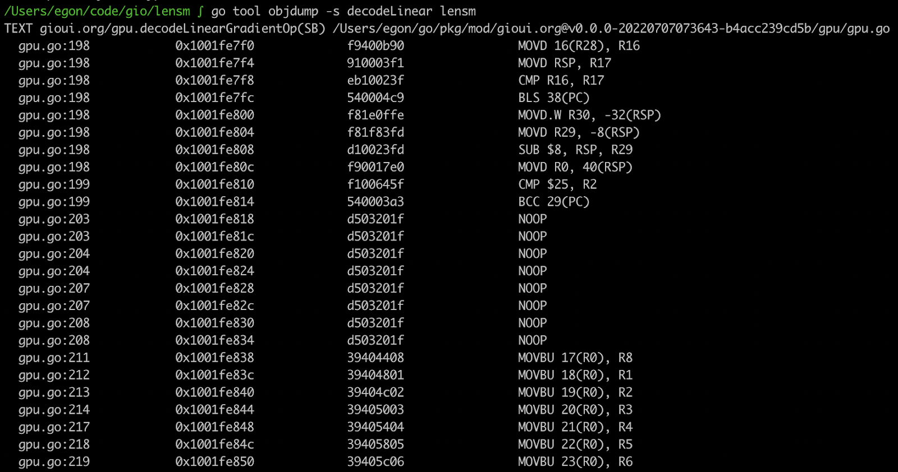There is an excellent online tool for writing code and seeing the output [https://go.godbolt.org](https://go.godbolt.org/). The visuals are much clearer.

The corresponding lines of code have the same color. When you hover over the specific lines of code, the corresponding assembly is also highlighted.

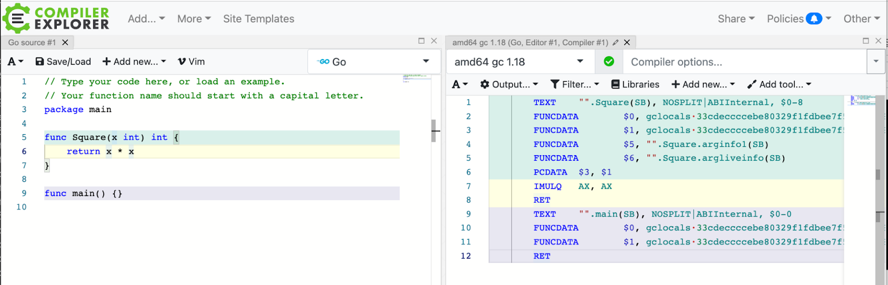Compiler Explorer has many other nice features as well: sharing the result, compiling with different versions, diffing output from different compilers, and description of assembly instructions. The amount of different languages and compilers is staggering.

Despite how nice Compiler Explorer is, it's still an online tool, and you need to copy-paste your relevant code to the explorer.

After trying many times, my annoyance finally kicked in:

*"Someone should've written this tool already–it shouldn't be too difficult."*

Over the years of developing, I've found that getting annoyed is a rather excellent way to start a new project.

# Disassembly

The first step in the project was to have access to the disassembly. It would be wasteful to start a disassembler from scratch. I knew that **go tool objdump** could already do it, so maybe they have some library they are using.

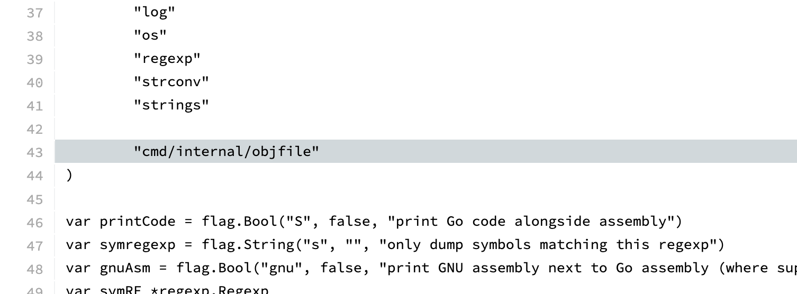Indeed, they are using a library, but it's internal to the compiler. The internal library looks pretty nice to use as well. I guess I need to extract it for my own needs. Copying the relevant code and adjusting the import paths was grunt work, but I got it extracted. Luckily the license for the Go code is open-source.

I needed to expose a little bit more information from the API to access the [necessary details](https://github.com/loov/lensm/commit/5bb596225accd3d6c0b4dbc13c4e6189c558c879#diff-1596bd8ceb74246828aacab827b39a33075c86baa627fbbeb7491bd31eef1169), but I got it working. Here's the debug print from the initial output:

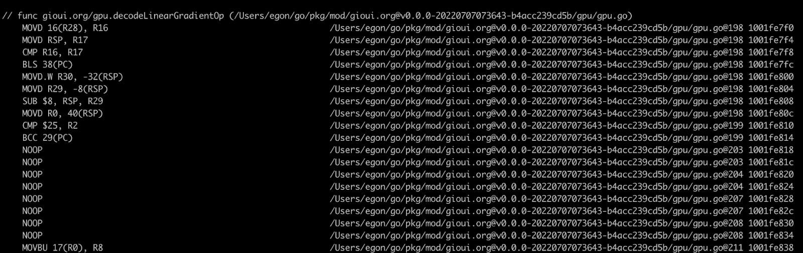Of course, extracting the internals means needing to keep it manually updated. I'm sure there was a tool to rewrite the paths and keep them automatically updated. Alternatively, maybe the Go project would accept a patch that exposes the information in some JSON format so the visualizer can call the appropriate Go compiler. But all of that is a project for another day.

## Extracting Source Code

The first important step was to figure out the relevant source code that needed to be loaded. This seems a relatively easy thing in concept. It's mainly "Collect the list of lines per source file". However, the gotcha is how to represent the data, and similarly, you probably don't want just the lines but also some of the surrounding code.

This is the basic structure for representing source:

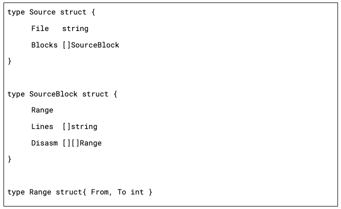Every assembly function can have multiple associated **Source** files due to inlining. Similarly, the code needed from different files isn't contiguous, and you wouldn't want to show more than is required.

Most of the data munging is: collect all the source lines, convert them into ranges, expand the ranges (for the surrounding context). We also need to do it in reverse: figure out which lines in disassembly correspond to the source code. Note that each source line can correspond to multiple disassembly lines, and they might not be contiguous.

Once I got it working, I did a debug print of the relevant source lines:

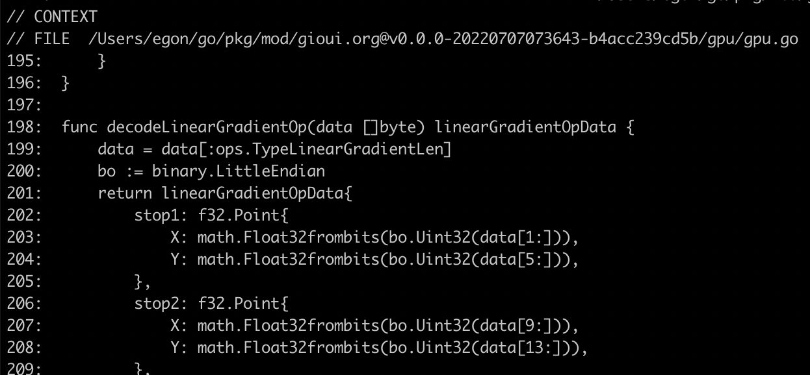# Drawing Code

I was trying to optimize the code for [Gio UI](https://gioui.org/), so of course, it was a natural choice for building a tool such as this. It has pretty lovely drawing capabilities that I'll need.

The question was then, how should it be visualized. Compiler Explorer visualization is a great starting point. However, it's not as clear as I would like it to be. When starting the project, I already had a design in mind. There are many source diffing tools that offer visualizing related lines. For example, here is what Meld tool looks like:

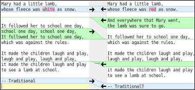There are other tools such as Kompare, CodeCompare, Oxygen Compare that offer similar visualization. I really like how it shows how one side is related to the other. To draw the shape, we can use the following idea:

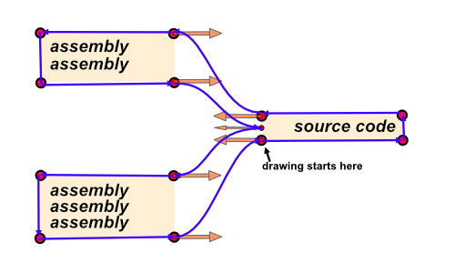*The purple lines show the final relation shape. The orange arrows show bezier curve handles.*

Drawing the visuals seemed then straightforward:

1. figure out the location of each line of the source and assembly;
2. draw the relation shape for each line of source and related assembly lines;
3. draw the text on top of the relation shapes.

One difficult thing people encounter with such projects is: how to choose a random color such that they are distinct, visually pleasing, and code is easy to write. One nice trick I've picked up over time is this formula:

*hue: index \* phi \* 2 \* PI, saturation: 60%, lightness: 60%*

You can adjust the saturation and lightness between 50% to 90% to get different lightness and saturation. If you want a more pastel color look, you would use a lower saturation and higher lightness. For dark mode, you would use lightness below 30%. (The color selection assumes that hue is defined with the range 0 .. 2\*PI). There are a few variations of the hue selection:

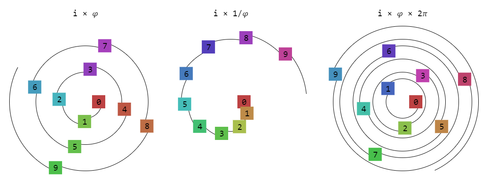As you can see, the 𝜑 = 1.618033988749… constant allows selecting values on a hue circle such that sequential numbers are different and won't repeat. If you want a smoother transition, then using i × 1/𝜑 works a treat. If you want more contrast, then i × 𝜑 × 2𝜋 is nicer.

Once you put all these ideas together, you get the first output:

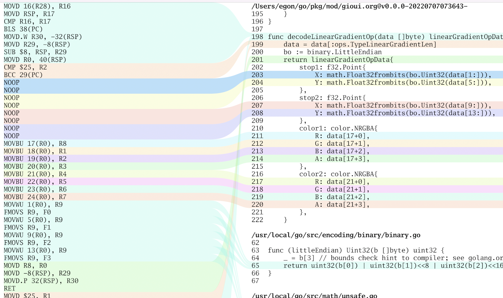I also added a small interaction – when you hover the mouse over a line of code, it highlights the relation shape.

## Drawing Jumps

The next thing I wanted to visualize was drawing jumps in the code. They are important from a performance perspective. It's relatively common for disassemblers to draw an arrow from the jump location to the destination. This brings up two problems, detecting the jumps, and figuring out how to draw the lines.

Unfortunately, the objfile library disassembler doesn't expose the information whether the instruction is a jump and when it jumps, then where to. I didn't want to dig too deep into this, so I reached for the usual tool for this – regular expression matching. It seemed that all the jumps ended with a hex number, such as **JMP 0x123**... of course, that approach broke. On arm processors, they look like **BLS 38(PC)**. I added a special case for it for now, but it'll probably break again on some other platform.

To draw the jumps initially, I just drew them like a stack. In other words, push the jump line to the sidebar when you encounter one and then pop it when it ends. Of course, that didn't look great due to overlapping lines:

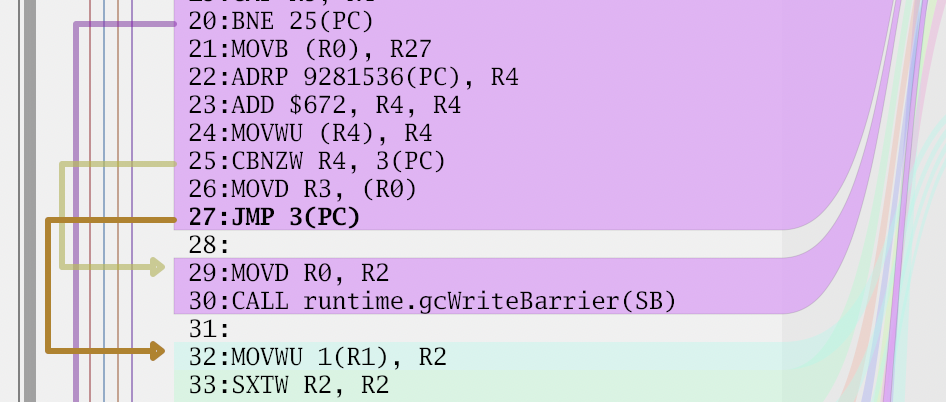In some cases it even caused the lines to be on top of each other. I searched for a nice algorithm for drawing them; however, I came up empty. Finally, I decided to go with the following approach, sort all the jump ranges based on their starting and ending point. If multiple ranges start from the same location, the larger range is sorted first. Then divide the sidebar into lanes; every new range picks the first lane that is free – starting from the left. This ends up minimizing crossings.

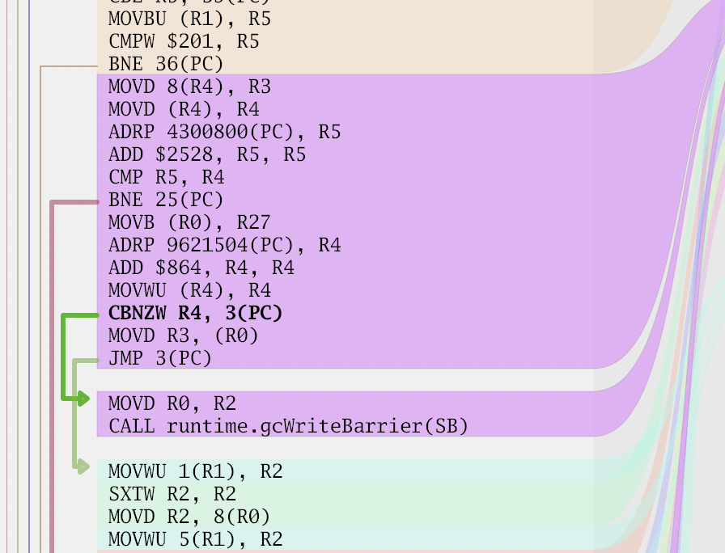It's by no means ideal. It can still draw the jump line too far from the code.

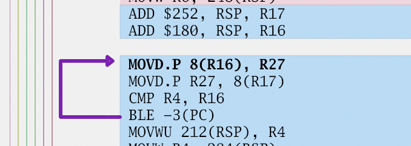Or do this thing here:

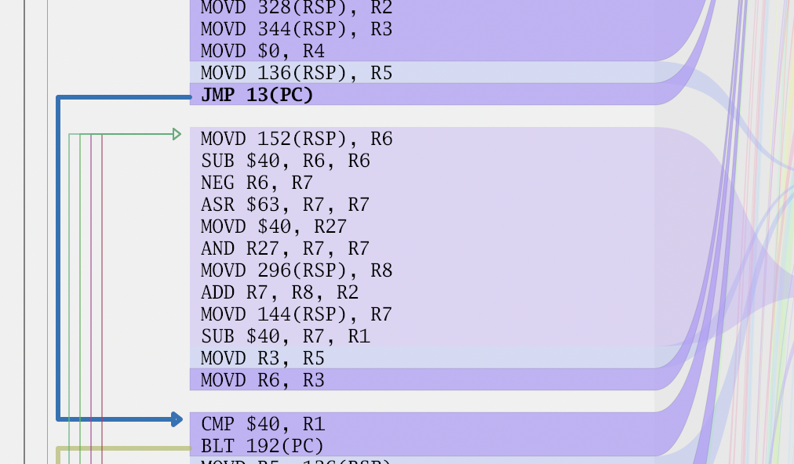But, these are things someone will fix some other day.

# Summary

After a few days of work, I have a nice tool for viewing disassembly. 

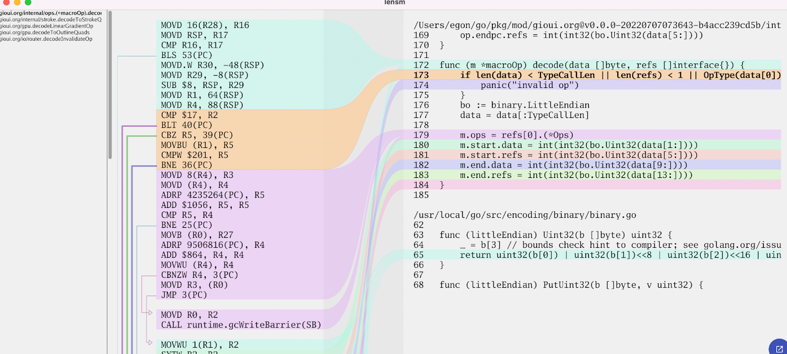Choosing a name was also a struggle. I wanted it to be easily recognizable and searchable. I asked in Gophers #performance channel and Jan Mercl suggested "lensm," which is "lens" and "asm" smushed together.

When you look at the code and think: "For a performance-conscious project, it doesn't look very efficient – allocations and suboptimal algorithms everywhere. Also, the code looks very messy."

That's all true, but the goal was to get it done quickly. And, if I do need to optimize, then I have an extra tool in my toolbelt to optimize it.

I'll still have a few things I want to add before I can call it sufficiently complete. Nevertheless, it's already functional, so give it a test run at <https://github.com/loov/lensm>. If you feel like something is missing, then come along for the ride and submit a patch; there have already been a few contributors.

