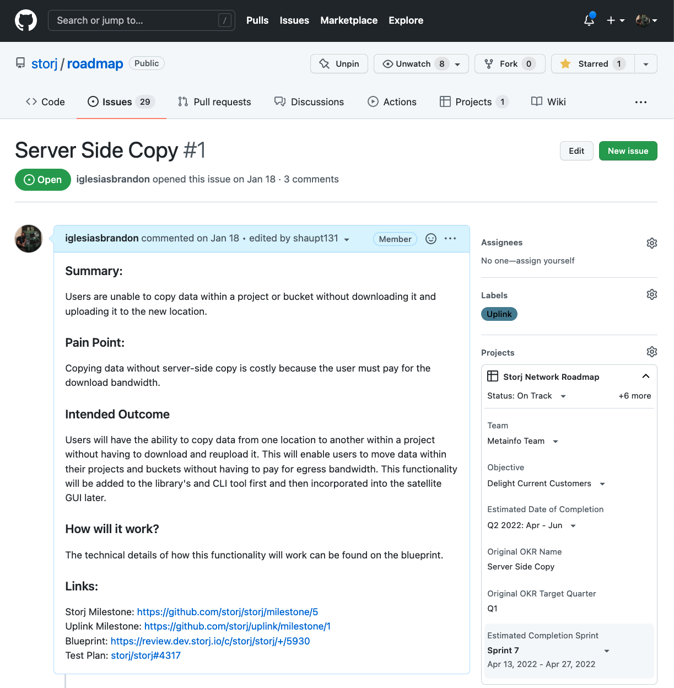

---
author:
  name: Brandon Iglesias
date: '2022-03-31 00:00:00'
heroimage: ./69c628262ae22ee5.png
layout: blog
metadata:
  description: "In October 2021, Storj announced we were going to adopt an open development\
    \ strategy for the storage node development efforts. The goal was to enable our\
    \ community\u2014and the wider open source community\u2014to contribute to the\
    \ development of the network. We started this effort by moving all node issues..."
  title: Storj Open Development -Part 2
title: Storj Open Development -Part 2

---

In October 2021, Storj [announced](https://www.storj.io/blog/storj-open-development-announcement) we were going to adopt an open development strategy for the storage node development efforts. The goal was to enable our community—and the wider open source community—to contribute to the development of the network. We started this effort by moving all node issues to the [storj Github repo](https://github.com/storj/storj/issues?q=is%3Aopen+is%3Aissue+label%3ASNO) and creating a public GitHub [project](https://github.com/orgs/storj/projects/6) to track them. This allows anyone in the [community](https://forum.storj.io/) to look at current and past issues, add comments, make code contributions, or open new issues.

‍

Over the last six months, our engineering and product teams have been adopting this open development strategy for all our efforts. Our teams have moved from private Jira tickets to Github issues/projects to create more transparency with what we are working on and allow the community to make contributions.

‍

In addition, we have made the Storj Network product road map public. The [product road map](https://github.com/storj) is a high-level overview of the features and functionality we plan on implementing over the next nine - twelve months. It is constantly evolving as we gain more input and insights from our customers and community, so keep in mind road map items are subject to change. 

‍

As a part of this open development initiative, before starting development the product team will now make product requirements documents (PRD) public, describing the problem/challenge we intend to solve for our customers. The engineering team uses the PRD to create a blueprint on how we intend to implement the functionality, and our QA team will develop a test plan. Through each of these steps, the documents will be published in our GitHub repositories where reviews and input from our community and customers are welcome and very much appreciated.

‍

‍

Team boards

* Storj Network road map: <https://github.com/orgs/storj/projects/23>
* Metainfo team: <https://github.com/orgs/storj/projects/13>
* Edge team: <https://github.com/orgs/storj/projects/29>
* Documentation: <https://github.com/orgs/storj/projects/31>

‍

\_\_\_\_\_\_\_\_\_\_\_\_\_\_\_\_\_\_\_\_\_\_\_\_\_\_\_\_\_\_\_\_\_\_\_\_\_\_\_\_\_\_\_\_\_\_\_\_\_\_\_\_\_\_\_\_\_\_\_\_\_\_\_\_\_\_\_\_\_\_\_\_\_\_

TLDR: 

We launched our open development strategy in October and have been making significant progress. Six months later, check out some of our initiatives:

* Moved issue tracking to Github where it's open and transparent to everyone
* Created the [Storj Network public road map](https://github.com/orgs/storj/projects/23) also on Github
* Continuing our [Bug bounty program](#)
* Looking for more contributions from the community

‍

