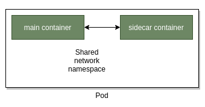
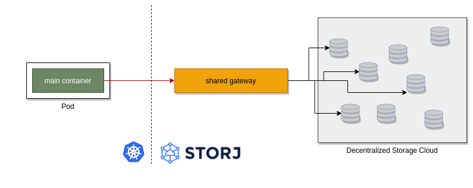
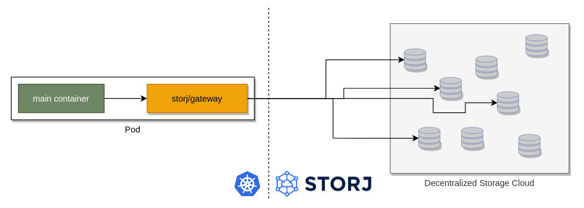
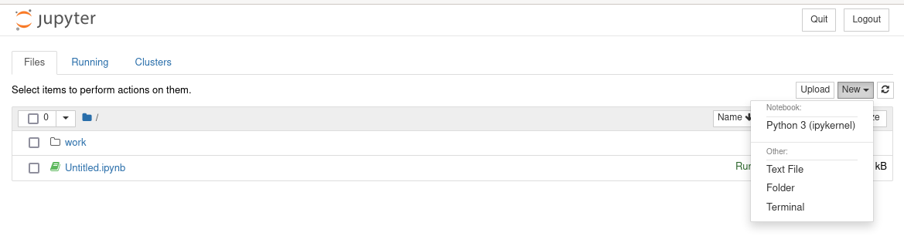
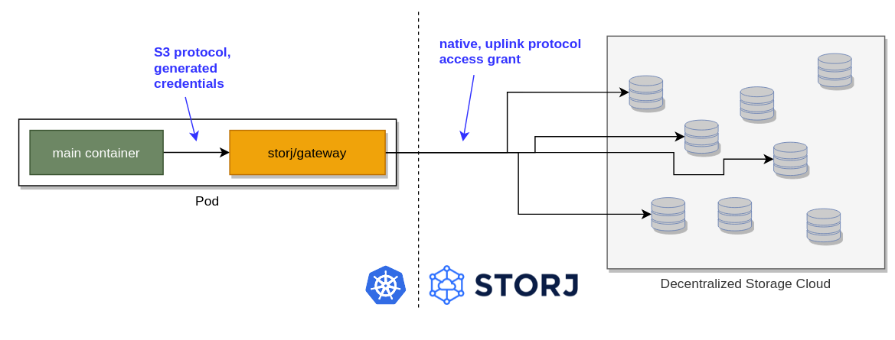
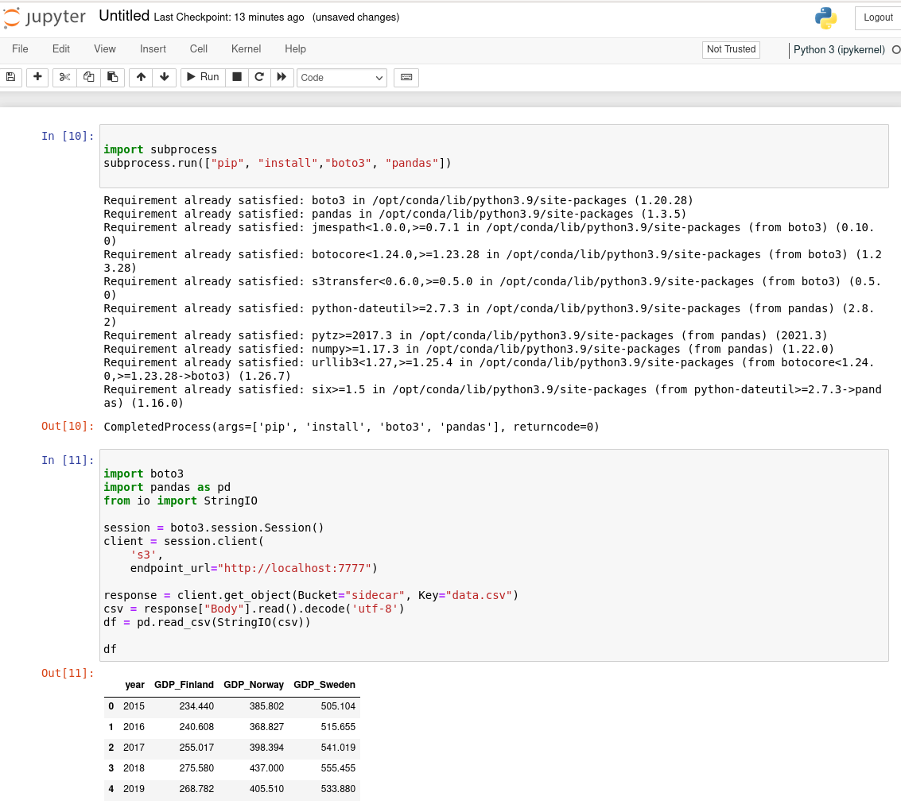

---
author:
 name: Marton Elek
date: '2022-03-07 00:00:00'
heroimage: ./344a9e476aa2b1ea.png
layout: blog
metadata:
 description: "Data stored in Storj Decentralized Cloud Storage can be accessed in\
  \ multiple ways:With native \u201Cuplink\u201D protocol, which connects directly\
  \ to the nodes where the data is storedWith using S3 compatible REST API, using\
  \ an S3 gateway:Either the hosted S3 gateway, operated by Storj LabsOr with running\
  \ ..."
 title: Use Storj DCS from Cloud-native Environments Using the Sidecar Pattern
title: Use Storj DCS from Cloud-native Environments Using the Sidecar Pattern
---
Data stored in Storj Decentralized Cloud Storage can be accessed in multiple ways:

1. With native “uplink” protocol, which connects directly to the nodes where the data is stored
2. With using S3 compatible REST API, using an S3 gateway:
    1. Either the hosted S3 gateway, operated by Storj Labs
    2. Or with running your own S3 gateways

The easiest way is using the shared S3 gateway with any S3 compatible tool (2.2.) but this approach may also have disadvantages:
1. The encryption keys are shared with the gateway
2. All traffic is routed to the gateway before accessing the data on storage nodes
In a powerful server environment (with enough network and CPU bandwidth) it can be more reasonable to use the native protocol and access the storage nodes directly. However, native protocol is not supported by as many tools as the S3 protocol.

Fortunately, in Kubernetes – thanks to the sidecar pattern – using the native protocol is almost as easy as using the shared gateway.
## Sidecar Pattern
The smallest deployable unit in Kubernetes is a pod. Pod is the definition of one or more containers with the attached volumes/resources/network usage. Typically, only one container is included in one pod, but sidecar patterns deploys an additional helper container to each pod.

As the network namespace is shared inside the pod the main container can access the features of the sidecar container.
To follow this pattern, we should deploy a sidecar container to each of our application pods.

Instead of using the hosted, multi-tenant version of the S3 gateway:



We will start a single-tenant S3 gateway with each of the services:


## Getting Started
Let’s start with a simple example: we will create a Jupyter notebook which reads data from a Storj bucket for following data science calculations.


A Jupyter notebook can be deployed with the following simplified deployment:

```yaml
apiVersion: apps/v1
kind: Deployment
metadata:
 name: jupyter
spec:
 replicas: 1
 selector:
   matchLabels:
     app: jupyter
 template:
   metadata:
     labels:
       app: jupyter
   spec:
     containers:
     - name: jupyter
       image: jupyter/base-notebook
       ports:
         - containerPort: 8888
           hostPort: 8888
```

(Please note that we use **hostPort** here. In a real cluster, service (load balanced, nodeIp) or ingress definition would be required, depending on the environment.)
‍

After deploying this definition to a Kubernetes cluster, we can access the Jupyter notebook application and write our own notebooks.

To open the Jupyter web application we need the secret token which is printed out to the standard output of the container:

```
kubectl logs -l app=jupyter -c jupyter --tail=-1

....
[I 14:12:50.361 NotebookApp] Serving notebooks from local directory: /home/jovyan
[I 14:12:50.361 NotebookApp] Jupyter Notebook 6.4.6 is running at:
[I 14:12:50.362 NotebookApp] http://jupyter-7546dc9f8c-ww4hb:8888/?token=32bc4f4617fcad6001895c966ce8df539f5f71a243197d5d
[I 14:12:50.362 NotebookApp]  or http://127.0.0.1:8888/?token=32bc4f4617fcad6001895c966ce8df539f5f71a243197d5d
[I 14:12:50.362 NotebookApp] Use Control-C to stop this server and shut down all kernels (twice to skip confirmation).
[C 14:12:50.366 NotebookApp]

	To access the notebook, open this file in a browser:
    	file:///home/jovyan/.local/share/jupyter/runtime/nbserver-8-open.html
	Or copy and paste one of these URLs:
    	http://jupyter-7546dc9f8c-ww4hb:8888/?token=32bc4f4617fcad6001895c966ce8df539f5f71a243197d5d
 	or http://127.0.0.1:8888/?token=32bc4f4617fcad6001895c966ce8df539f5f71a243197d5d
```
‍
And now we can create a new notebook where we use the Storj data:



To read data via S3 protocol, we need *boto*, the python S3 library, which can be added to the docker image or installed as a first step in the notebook:

```python
import subprocess
subprocess.run(["pip", "install","boto3", "pandas"])
```
‍
Next, we can read/use files directly from Storj:

```python
import boto3
import pandas as pd
from io import StringIO

session = boto3.session.Session()
s3_client = session.client(
   's3',
   aws_access_key_id="...",
   aws_secret_access_key="...",
   endpoint_url="https://gateway.eu1.storjshare.io")

response = client.get_object(Bucket="sidecar", Key="data.csv")
csv = response["Body"].read().decode('utf-8')
df = pd.read_csv(StringIO(csv))

df
```
‍
The approach uses the shared S3 gateway and requires access key and secret credentials generated as documented [here](docId:yYCzPT8HHcbEZZMvfoCFa).

## Activating the Sidecar
Let’s improve the previous example by using the sidecar pattern. First, we need to generate an [*access grant*](docId:b4-QgUOxVHDHSIWpAf3hG) instead of the S3 credentials to access Storj data, and we should define any S3 credentials for our local, single-tenant S3 gateway:




Let’s create a Kubernetes secret with all of these:

```bash
export ACCESS_GRANT=...generated_by_ui…

kubectl create secret generic storj-gateway \
--from-literal=storj-gateway-key=$(pwgen -n 18) \
--from-literal=storj-gateway-secret=$(pwgen -n 18) \
--from-literal=storj-access-grant=$ACCESS_GRANT
```
‍
Now we can enhance our Kubernetes deployment by adding one more container (put it under spec/template/spec/containers):

```yaml
     - name: storj-sidecar
       image: storjlabs/gateway
       args:
         - run
       env:
       - name: STORJ_MINIO_ACCESS_KEY
         valueFrom:
           secretKeyRef:
             name: storj-gateway
             key: storj-gateway-key
       - name: STORJ_MINIO_SECRET_KEY
         valueFrom:
           secretKeyRef:
             name: storj-gateway
             key: storj-gateway-secret
       - name: STORJ_ACCESS
         valueFrom:
           secretKeyRef:
             name: storj-gateway
             key: storj-access-grant
```
‍
This container is configured to access the Storj API (using the STORJ\_ACCESS environment variable) and secured by STORJ\_MINIO\_ACCESS\_KEY and STORJ\_MINIO\_SECRET\_KEY.

Now we can access any Storj object from our Storj bucket, but we can also make it more secure without hard-coding credentials during the initialization of the python S3 client. We should add two more environment variables to the existing Jupyter container to make it available for the client:

```yaml
   spec:
     containers:
     - name: jupyter
       image: jupyter/base-notebook
       ports:
         - containerPort: 8888
           hostPort: 8888
       env:
       - name: AWS_ACCESS_KEY_ID
         valueFrom:
           secretKeyRef:
             name: storj-gateway
             key: storj-gateway-key
       - name: AWS_SECRET_ACCESS_KEY
         valueFrom:
           secretKeyRef:
             name: storj-gateway
             key: storj-gateway-secret
     - name: storj-sidecar
```

With this approach, we can initialize the S3 client without hard-coding the credentials:

```python
session = boto3.session.Session()
client = session.client(
   's3',
   endpoint_url="http://localhost:7777")
```

Note: http://localhost:7777 is the address of the single-tenant Storj gateway which is running in the same pod.

## Summary
Sidecar pattern is an easy way to access our data from Storj Decentralized Cloud Storage using the power of the native protocol, even if our application is compatible only with the S3 Rest API.



