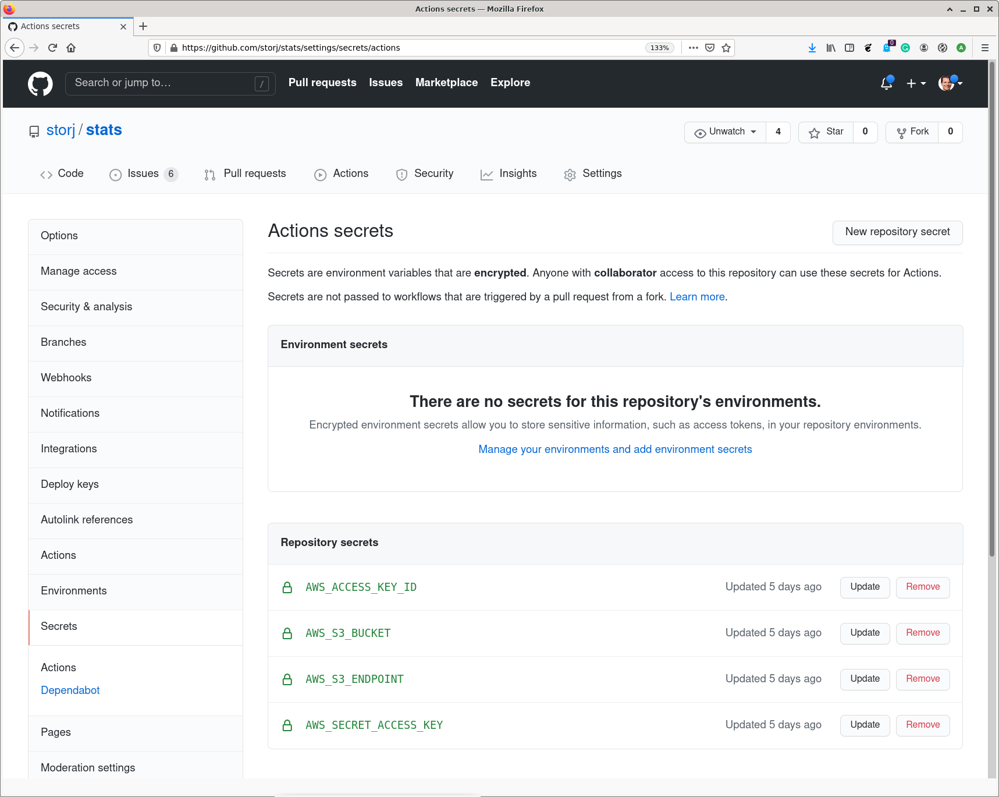
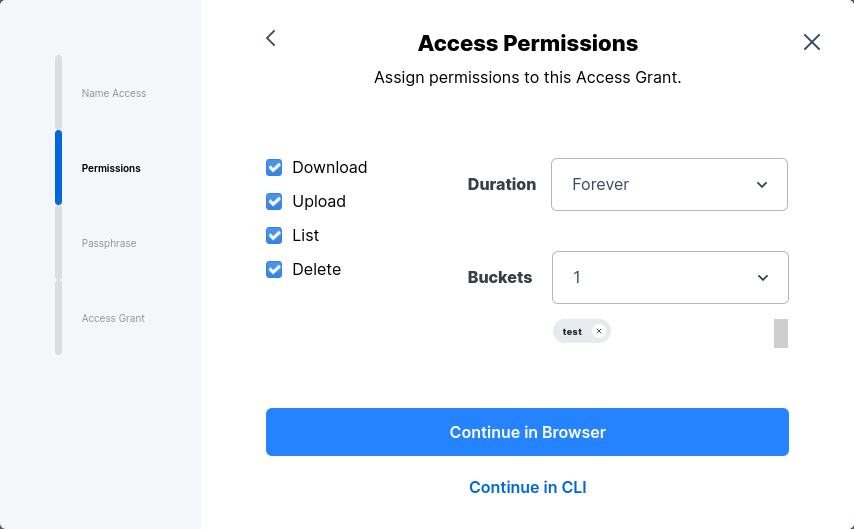
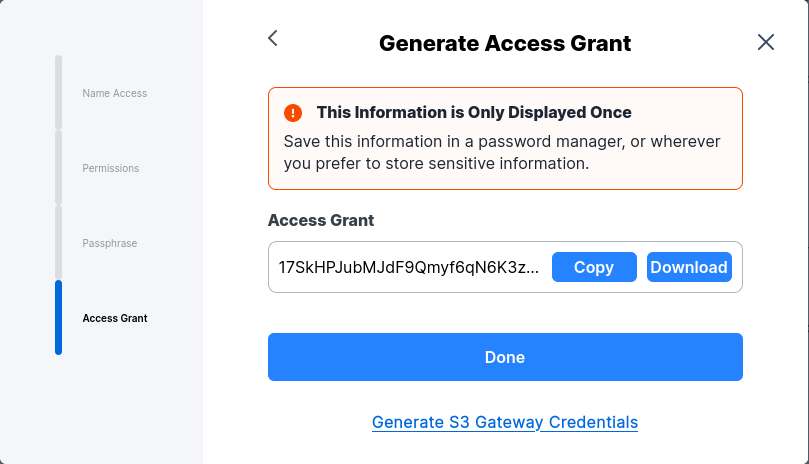
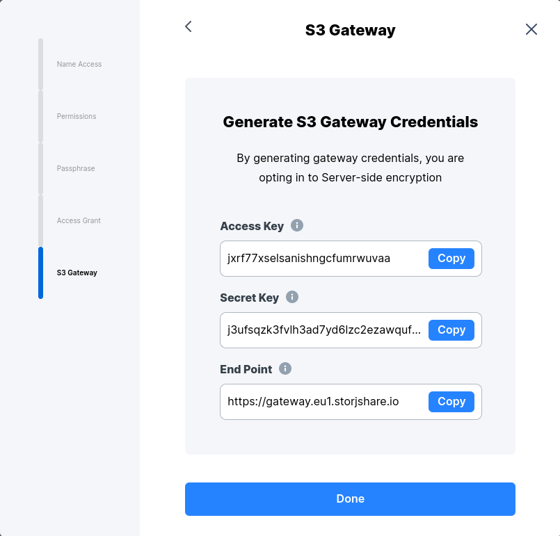

---
author:
  name: Kaloyan Raev
date: '2021-08-31 00:00:00'
heroimage: ./9ccdc75d22b6993e.png
layout: blog
metadata:
  description: GitHub Actions is their system to automate, customize, and execute
    software development workflows in the GitHub repository. This article will inform
    you how to upload files to a Storj DCS bucket from a GitHub Actions workflow.The
    Storj DCS Public Network Stats is one of the projects at Storj wher...
  title: Using Storj DCS with GitHub Actions
title: Using Storj DCS with GitHub Actions

---

[GitHub Actions](https://docs.github.com/en/actions) is their system to automate, customize, and execute software development workflows in the GitHub repository. This article will inform you how to upload files to a Storj DCS bucket from a GitHub Actions workflow.  


The [Storj DCS Public Network Stats](https://stats.storjshare.io/) is one of the projects at Storj where we use GitHub Actions. The statistics are hosted as a [static website](docId:GkgE6Egi02wRZtyryFyPz) on Storj DCS, so we have an easy way to redeploy the homepage when we merge any modification in the code repository. We created a GitHub Actions workflow that converts the Markdown file of the homepage to an HTML file and then uploads it to the bucket hosting the website.


GitHub Actions has a marketplace for actions created by the community. Instead of creating our own Storj-specific action to upload files to Storj DCS, we decided to keep it simple and use the [s3-sync-action](https://github.com/jakejarvis/s3-sync-action) that the community has already created. The s3-sync-action allows uploading files to an S3-compatible storage service, so we took advantage of Storj Gateway-MT - the globally available, multi-region hosted S3-compatible gateway.  


Let’s break down the specific GitHub Actions workflow for the Storj DCS Public Network Stats project. [The complete workflow is here](https://github.com/storj/stats/blob/main/.github/workflows/upload-homepage.yml).   


Every workflow starts with declaring its name:


```

# This is a workflow converts homepage.md to index.html
# and uploads it to the static website
name: upload homepage

```

  


Then follow the rules for triggering the workflow:  


```

# Controls when the workflow will run
on:
  # Triggers the workflow only on push event to the main branch,
  # but not for pull requests
  push:
    branches: [ main ]
    # Triggers the workflow only if the homepage.md file has been         # edited
    paths:
      - 'homepage.md'

```

  


In this case, the workflow triggers when a commit is merged to the main branch, and that commit modifies the homepage.md file.  


Next, we have the definition of the job that will be run when the above event triggers:  


```

# A workflow run is made up of one or more jobs that can run
# sequentially or in parallel
jobs:
  # This workflow contains a single job called "build"
  build:
    # The type of runner that the job will run on
    runs-on: ubuntu-latest
    # Steps represent a sequence of tasks that will be executed as
# part of the job
    steps:

```

  


The job will run on an Ubuntu VM and will execute the following three steps:

1. Check out the head of the GitHub repository  

```

# Checks-out your repository under $GITHUB_WORKSPACE,
# so your job can access it
- uses: actions/checkout@v2

```
2. Convert the homepage.md file to index.html  

```

# Converts the homepage.md file to index.html
- uses: ZacJW/markdown-html-action@1.1.0
  with:
    input_files: '[["homepage.md"]]'
    output_files: '["index.html"]'
    extensions: '[]' # Alas, this cannot be skipped even if empty

```
3. Upload the index.html file to the Storj DCS bucket.  

```

# Uploads the index.html file to the root of the destination bucket
- uses: jakejarvis/s3-sync-action@v0.5.1
  with:
  # This is a workaround as SOURCE_DIR does not support
  # a single file
    args: --exclude '*' --include 'index.html'
  env:
    AWS_S3_ENDPOINT: ${{ secrets.AWS_S3_ENDPOINT }}
    AWS_S3_BUCKET: ${{ secrets.AWS_S3_BUCKET }}
    AWS_ACCESS_KEY_ID: ${{ secrets.AWS_ACCESS_KEY_ID }}
    AWS_SECRET_ACCESS_KEY: ${{ secrets.AWS_SECRET_ACCESS_KEY }}

```

The destination bucket and the S3 credentials for s3-sync-action are configured through environment variables. In this case, we use [encrypted secrets](https://docs.github.com/en/actions/reference/encrypted-secrets) from the GitHub repository to keep this information private and safe from public eyes.  


Encrypted secrets can be configured in the “Secrets” section of the repository settings.   




All these secrets can be created via the Storj Satellite web interface. After logging in to the web interface, we make sure that the target bucket is already created. If not, the easiest way to create it is using the [Object Browser](docId:4oDAezF-FcfPr0WPl7knd). Then we set the name of the bucket as the AWS\_S3\_BUCKET secret in the Github repository.


Having the bucket created, next, we create S3 credentials that grant access to that bucket. This is done by [creating a new access grant from the web interface](docId:AsyYcUJFbO1JI8-Tu8tW3#generate-s3-compatible-credentials).


In the Permissions dialog, we make sure to limit the access only to the target bucket instead of giving access to the whole project.



In the Access Grant dialog, we click on the Generate S3 Gateway Credentials button.




This generates the S3 credentials for the access grant that can be used with Gateway-MT.




We use these credentials to set the remaining secrets in the Github repository:

* AWS\_ACCESS\_KEY\_ID is set to the Access Key value
* AWS\_SECRET\_ACCESS\_KEY is set to the Secret Key value
* AWS\_S3\_ENDPOINT is set to the End Point value

With this, everything is now complete to run the GitHub Actions workflow successfully.  


If you have any questions, please feel free to reach out to us at [support@storj.io](mailto:support@storj.io) or visit <https://supportdcs.storj.io/hc/en-us>.   


