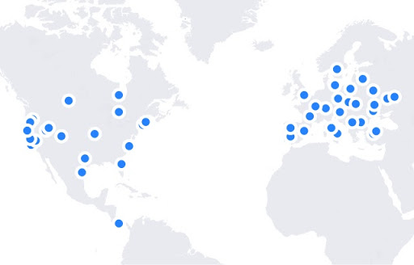

---
author:
  name: Brandon Iglesias
date: '2020-10-21 00:00:00'
heroimage: ./6371747a59800613.jpeg
layout: blog
metadata:
  description: At Storj Labs we're distributed system junkies. We enjoy building highly
    distributed, ridiculously resilient software. The Storj Network is currently spread
    across over 10,000 uncorrelated endpoints, and that number is growing fast.The
    global substrate of diverse, uncorrelated endpoints across wh...
  title: Visualizing Decentralized Data Distribution with the Linksharing Object Map
title: Visualizing Decentralized Data Distribution with the Linksharing Object Map

---

At Storj Labs we're distributed system junkies. We enjoy building highly distributed, ridiculously resilient software. The Storj Network is currently spread across over 10,000 uncorrelated endpoints, and that number is growing fast.

The global substrate of diverse, uncorrelated endpoints across which the network runs is unmatched by any other cloud provider.

Storage Nodes run across a diverse distribution of operating systems, hardware types, geographic locations, and owners. Node Operator software runs on Linux systems like Ubuntu, CentOS, Debian, and Fedora, as well as macOS and Windows, with a native MSI installer. Storage Nodes run in Docker containers as well as compile to native binaries for ARM and AMD64. Hardware ranges from basic Raspberry Pis to QNAP NAS devices.

Now that we have Storage Nodes across the world, we decided to build a simple visualization tool to showcase just how distributed and resilient the files stored on Tardigrade actually are.

### Distributed Storage, Visualized

Through this tool—which is called the Linksharing Object Map—our team and our community can visualize the geographic distribution of data uploaded to our Tardigrade service. This showcases how resilient the network is, as well as the wide geographic distribution of Nodes holding each object.

We set out to build the Linksharing Object Map Dashboard at the start of the two-day Storj Labs employee hackathon and quickly productized and completed the project.

Try it out yourself by generating access for an object, and creating a link share for the URL, [like outlined in our documentation](https://documentation.tardigrade.io/getting-started/uploading-your-first-object/view-distribution-of-an-object). This process will generate a link with a macaroon (embedded, [hash-based logic](https://storj.io/blog/2019/12/secure-access-control-in-the-decentralized-cloud/)) that controls how the object can be accessed.

See an example of the Node map yourself, here: [Link share Object Map](https://bit.ly/31qVdyc)

### Uplink Visualizer: The tech and how it works

The Uplink Visualizer is a simple GoLang application that ingests, transforms, and visualizes client-side data from the uplink client. The tool grabs the IP addresses of the Storage Nodes holding pieces for a given object and displays them on a map.

Essentially, there's an endpoint on the Satellite that will return the IP address of all the Storage Nodes holding pieces for an object on the network if you have permission to download it with your API key.

We use [MaxMind](https://github.com/maxmind/) to convert the list of the IP addresses to their corresponding global longitudes and latitudes. We then use [LeafletJS](https://leafletjs.com/) to message the geo locations to be displayed on the leaflet js map.

### Try it yourself, and be the cloud!

We're excited for you to try the Uplink Object Map and check out its [code](https://github.com/storj/linksharing). It's licensed under Apache-2.0 License, and because it's open source (like most of the code we produce), you can also contribute to the tool as well. If you have any feedback on the visualizer or find it useful, please let us know at <http://forum.storj.io/>.

Finally, if you like the look and feel of the tool, please let the world know, and tweet it to us @storjproject—we always reshare and promote our community's content and efforts!

Please note that this is a GENERIC location so the Storage Nodes actual location is not disclosed. A user is ONLY able to get this information for a file if they have permission to download it.

