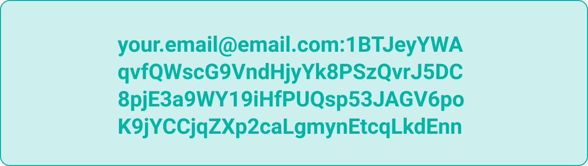

# Authorization Token

## Authorization Token

Make sure you have received your personal single-use authorization token. It looks like this:


If you have not received an authorization token yet, **** [**sign up.**](https://registration.storj.io)****


By using your authorization token, you agree to the [Storage Node Operator Terms and Conditions](https://storj.io/storj-operator-terms).
