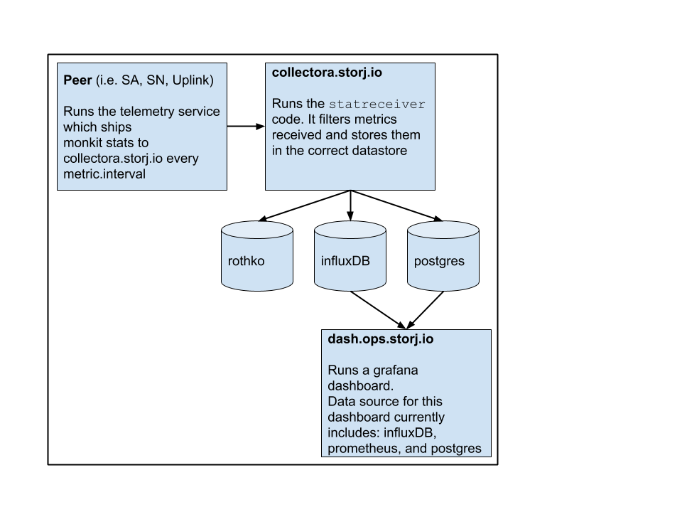

# Metrics

This document outlines how metrics are collected, where metrics are stored, and how they can be viewed.

### Metrics data flow

There are a number of packages and services involved in metric gathering for the Storj network.

This diagram displays the high level flow of metric data. Below describes the diagram in detail.



1. All of the Storj peers (i.e. satellite, storage node, uplink, etc) participate in metric collection. When a peer starts up, it begins collecting the following metrics via the telemetry client:
- [package's environment data](https://godoc.org/gopkg.in/spacemonkeygo/monkit.v2/environment)
- [hardware monitoring](https://github.com/jtolds/monkit-hw)
- [storj source code tracing](https://github.com/spacemonkeygo/monkit)

Reference:
- [metrics init source code](https://github.com/storj/storj/blob/main/pkg/process/metrics.go#L32)
- [telemetry client source code](https://github.com/storj/storj/blob/main/pkg/telemetry/client.go#L105)

2. The telemetry client is configured via the peer config.yaml file. By default it sends the metrics to a server, `collectora.storj.io`, which is running the `statreceiver` binary.

3. `statreceiver` allows you to filter and process incoming timeseries metrics. `statreceiver` is configed with a [`lua`](http://www.lua.org/) config file. This config file describes where metrics will be received from, how to parse/filter the metrics, where to store the metrics.

Reference:
- [`statreceiver` source code](https://github.com/storj/storj/tree/main/cmd/statreceiver)
- [example `lua` config file](https://github.com/storj/storj/blob/main/cmd/statreceiver/example.lua)

4. Metrics are stored in a number of datastores, each of which have a different purpose.
- `postgres` stores metrics used by the data science team.
- [`influxDB`](https://www.influxdata.com/) stores metrics over time about specifc nodes.
- [`rothko`](https://github.com/vivint/rothko) stores time-series data about the overall distributions across all nodes of each metric, but not about specific nodes.

5. The metrics data from `influxDB` are fed to a grafana dashboard that is behind a VPN. The `rothko` data isn't currently accessable via a visualization tool.

### How to locally run the metric collection process

For debugging purposes, `statrecevier` can be run locally along with `storj-sim` to collect and view metrics. Here are the steps on how to set that up:

The following steps assume the [Storj repo](https://github.com/storj/storj) can already be built and run locally. All commands occur from root of the storj repo directory.

1. create a `lua` pipline config that defines the source and destination of the metrics

```
# pipeline.lua
source = udpin("localhost:9000")
destination = parse(print())

deliver(source, destination)
```

2. run `statreceiver` with lua pipeline config

`$ statreceiver --input pipeline.lua`

3. in a different shell, setup storj-sim configs

`$ storj-sim network setup`

4. add the following settings to the config of the peer you want to gather metrics for:

```
# address to send telemetry to
metrics.addr: "localhost:9000"

# application name for telemetry identification
metrics.app: "<peer-name>-"

# application suffix
metrics.app-suffix: "sim"

# how frequently to send up telemetry
metrics.interval: 10s
```
5. run storj-sim

`$ storj-sim network run`

In the terminal where `statreceiver` is running, there should be metrics printing to the screen.
