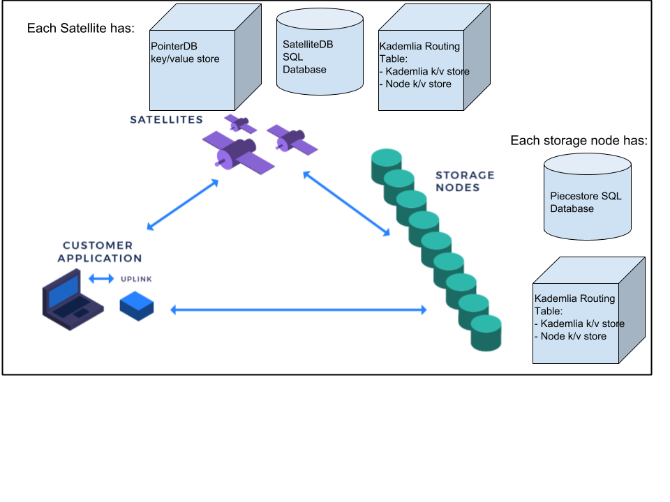

# Databases

This document decribes the following:
- [The various databases used for each component in the Storj network.](#Storj-components-with-databases)
- [How to view the contents of the various databases.](#View-the-Contents-of-a-Database)
- [Steps on how to modify existing databases.](#Steps-to-Modify-Existing-Databases)

## Storj Components With Databases

Each component of the Storj network (i.e. satellites, storage nodes, uplinks) has different persistent data stores.

Satellites have three databases:
1. SatelliteDB, also called the master database.
2. PointerDB.
3. Kademlia Routing Table.

Storage Nodes have two databases:
1. Piecestore database.
2. Kademlia Routing Table.

See below for more details about each database.

## Satellites

Satellites store the most data of all the components.

Satellites have three databases:
1. SatelliteDB, also called the master database.
2. PointerDB.
3. Kademlia Routing Table.

#### SatelliteDB

The SatelliteDB is a SQL relational database. Currently supported are SQLite3 and PostgreSQL.

There are a number of different tables in the SatelliteDB including the following:
- Users
- Accounting
- Nodes and Overlay Cache Nodes
- Projects and ApiKeys
- and more

References:
- [PostgreSQL documentation](https://www.postgresql.org/docs/)
- [SQLite documentation](https://sqlite.org/doclist.html)

#### PointerDB

PointerDB is a key/value store. Currently supported are BoltDB and Postgresql k/v store.  PointerDB stores information about pieces and which storage nodes they are stored on.

Keys in PointerDB are a path name (Storj.Path object) in the format "projectName/segment/bucketName".

Values in PointerDB are Pointer objects. Pointer objects store metadata about where pieces are stored on which nodes.

Reference:
- Source code for [Pointer objects](https://github.com/storj/storj/blob/master/pkg/pb/pointerdb.pb.go#L263).
- [BoltDB](https://github.com/boltdb/bolt) documentation.

#### Kademlia Routing Table

Kademlia Routing Table is a BoltDB key/value store. The routing table is represented by a kademlia key/value store and a node key/value store in one BoltDB instance.

## Storage Nodes

Storage Nodes have two databases:
1. Piecestore database.
2. Kademlia Routing Table.

#### Piecestore Database

The Piecestore Database is a SQL relational database. Currently SQLite3 is supported.

The Piecestore database stores metadata about the data pieces the Storage Node is storing.

Reference:
- Source code for [Piecestore database](https://github.com/storj/storj/tree/master/pkg/piecestore/psserver/psdb).

## Uplinks

Uplinks do not have any persistent storage.

## View the Contents of a Database

#### SQLite

To view the contents of a sqlite3 database file, you can use the command `sqlite3`. This comes installed by default on OSX.  See documentation on for details [SQLite CLI](https://sqlite.org/cli.html).

#### BoltDB

To view the contents of a BoltDB database file, there are a number of BoltDB browser tools.  See [bolt browser](https://github.com/br0xen/boltbrowser) or [bolter](https://github.com/hasit/bolter) as options.

#### PostgreSQL

To view the contents of a PostgreSQL database, use the `psql` command line program.  See [`psql` docs](https://www.postgresql.org/docs/9.2/app-psql.html) for details.

## Steps to Modify Existing Databases

#### Satellite

- [How to add a new table to SatelliteDB](Satellite-how-to-new-table.md)
