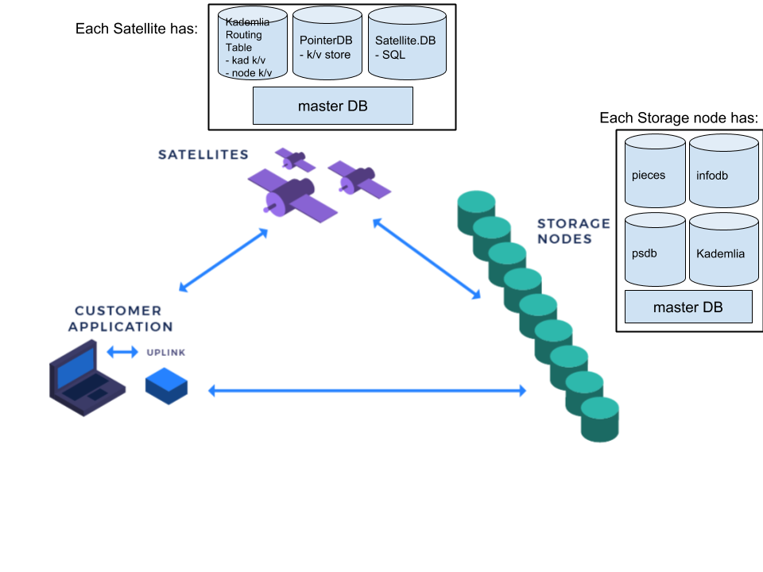

# Databases

This document decribes the following:

* [The various databases used for each component in the Storj network.](databases.md#Storj-components-with-databases)
* [How to view the contents of the various databases.](databases.md#View-the-Contents-of-a-Database)
* [Steps on how to modify existing databases.](databases.md#Steps-to-Modify-Existing-Databases)

## Storj Components With Databases

Each component of the Storj network \(i.e. satellites, storage nodes, uplinks\) has different persistent data stores.

Satellites and Storage Nodes both have a single Database interface, referred to as the master DB. The master DB specifies which databases are needed, it doesn't specify how they are implemented. This means different satellites can use different backends.

Satellites have three databases behind the master DB interface.

The three databases are: 1. Satellite.DB 2. PointerDB 3. Kademlia Routing Table

Storage Nodes have many databases behind the master DB interface.

The databases include: 1. pieces 2. infodb 3. psdb 4. Kademlia Routing Table

 See below for more details about each database.

## Satellites

Satellites store the most data of all the components. Satellites have three databases behind one interface. The interface is called the master DB. The master database specifies which databases are needed, it doesn't specify how they are implemented. This means different satellites can end up with different backends.

Satellites have three databases: 1. Satellite.DB. 2. PointerDB. 3. Kademlia Routing Table.

### Satellite.DB

The Satellite.DB is a SQL relational database. Currently supported are SQLite3 and PostgreSQL.

There are a number of different tables in the Satellite.DB including the following:

* Users
* Accounting
* Nodes and Overlay Cache Nodes
* Projects and ApiKeys
* and more

References:

* [PostgreSQL documentation](https://www.postgresql.org/docs/)
* [SQLite documentation](https://sqlite.org/doclist.html)

### PointerDB

PointerDB is a key/value store. Currently supported are BoltDB and Postgresql k/v store. PointerDB stores information about pieces and which storage nodes they are stored on.

Keys in PointerDB are a path name \(Storj.Path object\) in the format "projectName/segment/bucketName".

Values in PointerDB are Pointer objects. Pointer objects store metadata about where pieces are stored on which nodes.

Reference:

* Source code for [Pointer objects](https://github.com/storj/storj/blob/master/pkg/pb/pointerdb.pb.go#L263).
* [BoltDB](https://github.com/boltdb/bolt) documentation.

### Kademlia Routing Table

Kademlia Routing Table is a BoltDB key/value store. The routing table is represented by two bolt buckets \("bucket" in bolt is the same as "table"\): 1\) a kademlia key/value store \(i.e. bolt bucket\) and 2\) a node key/value store \(i.e. bolt bucket\) in one BoltDB instance.

The kademlia bolt bucket stores the following data:

* key: k-bucket IDs \(k-buckets are groupings of nodeIDs based on prefix, read original [kademlia paper](https://pdos.csail.mit.edu/~petar/papers/maymounkov-kademlia-lncs.pdf) for details of k-buckets\)
* value: timestamp

The node bolt bucket stores the following data:

* key: nodeIDs
* value: contact info for that node

Resources:

* [Slide deck](https://docs.google.com/presentation/d/1jY9mu8SVmVqirbo_yFIJjHWbeHrEc1NxWkFS1iauT_I/edit?usp=sharing) to a great talk [Jennifer](https://github.com/jenlij) did on storj Kademlia implementation.

## Storage Nodes

Storage Nodes have four databases behind a single master DB interface.

The databases include: 1. pieces 2. infodb 3. psdb 4. Kademlia Routing Table

### pieces Database

pieces is an interface to disk blob storage. pieces saves the actual pieces.

### info Database

A SQL database that contains six tables. The tables contain information on:

* OrderArchive and UnsentOrders: stores sent and unsent orders to track what still needs to be sent to the Satellite.
* PieceInfo: stores piece meta info, tracking what pieces are currently stored.
* Cert: stores uplink and satellite certificates.
* Bandwidth: stores bandwidth usage info, tracking how much bandwidth has been transferred.
* UserSerials: stores serial numbers that have already been used.

### psdb Database

Is a SQL database that stores bandwidth agreements.

## Uplinks

Uplinks do not have any persistent storage.

## View the Contents of a Database

### SQLite

To view the contents of a sqlite3 database file, you can use the command `sqlite3`. This comes installed by default on OSX. See documentation on for details [SQLite CLI](https://sqlite.org/cli.html).

`$ sqlite3 path/to/db/file`

### BoltDB

To view the contents of a BoltDB database file, there are a number of BoltDB browser tools. See [bolt browser](https://github.com/br0xen/boltbrowser) or [bolter](https://github.com/hasit/bolter) as options.

`$ boltbrowser path/to/boltdb/file`

### PostgreSQL

To view the contents of a PostgreSQL database, use the `psql` command line program. See [`psql` docs](https://www.postgresql.org/docs/9.2/app-psql.html) for details.

`$ psql -h hostname -U user`

## Steps to Modify Existing Databases

### Satellite

* [How to add a new table to Satellite.DB](satellite-how-to-new-table.md)

