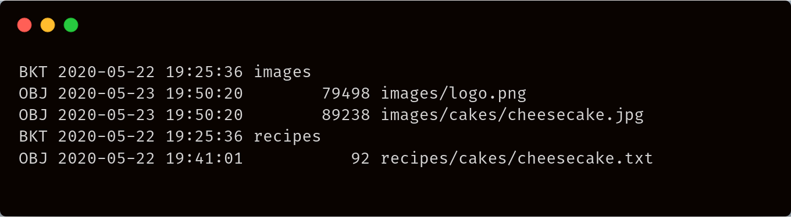
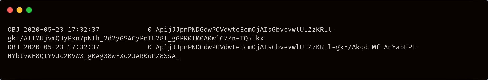

# ls

## Usage



```
./uplink.exe ls [sj://BUCKET[/PREFIX]] [flags]
```



```
uplink ls [sj://BUCKET[/PREFIX]] [flags]
```



```
uplink ls [sj://BUCKET[/PREFIX]] [flags]
```



## Flags

| Flag                | Description                                                                                        |
| ------------------- | -------------------------------------------------------------------------------------------------- |
| `--access string`   | the serialized access, or name of the access to use                                                |
| `--encrypted`       | if true, show paths as base64-encoded encrypted paths                                              |
| `--expanded`, `-x`  | Use expanded output, showing object expiration times and whether there is custom metadata attached |
| `--help`, `-h`      | help for ls                                                                                        |
| `--pending`         | if true, list incomplete objects instead                                                           |
| `--recursive`, `-r` | if true, list recursively                                                                          |

## Examples

_We consider the following object hierarchy throughout these examples:_


_We assume the `cakes/very-secret-recipe.txt` object has been uploaded using a different encryption key than the other objects in the project._

### List buckets



```
./uplink.exe ls
```



```
uplink ls
```



```
uplink ls
```




### List objects in a bucket



```
./uplink.exe ls sj://images
```



```
uplink ls sj://images
```



```
uplink ls sj://images
```




### List by prefix



```
./uplink.exe ls sj://images/cakes
```



```
uplink ls sj://images/cakes
```



```
uplink ls sj://images/cakes
```




### List recursively



```
./uplink.exe ls --recursive 
```



```
uplink ls --recursive 
```



```
uplink ls --recursive 
```





### List encrypted paths of all objects in a bucket



```
./uplink.exe ls sj://recipes --encrypted --recursive
```



```
uplink ls sj://recipes --encrypted
```



```
uplink ls sj://recipes --encrypted
```





Notice that since `sj://recipes/cakes/very-secret-recipe.txt` was encrypted with a different key, we cannot view it using regular ls and the default access, but with `--encrypted` we can see that it is indeed stored in sj://recipes
