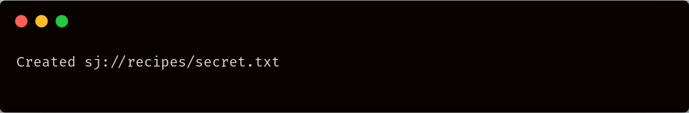

# put

## Usage



```
./uplink.exe put sj://BUCKET/KEY [flags]
```



```
uplink put sj://BUCKET/KEY [flags]
```



```
uplink put sj://BUCKET/KEY [flags]
```



## Flags

| Flag              | Description                                         |
| ----------------- | --------------------------------------------------- |
| `--access string` | the serialized access, or name of the access to use |
| `--help`, `-h`    | help for put                                        |

## Example



```
echo "Very secret ingredient list" | ./uplink.exe put sj://recipes/secret.txt
```



```
echo "Very secret ingredient list" | uplink put sj://recipes/secret.txt
```



```
echo "Very secret ingredient list" | uplink put sj://recipes/secret.txt
```





You can check the content of the file by using the [`cat`](cat-command.md) command.
