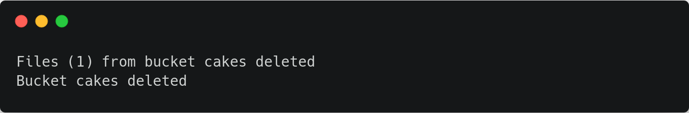

# rb

## Usage



```
./uplink.exe rb sj://BUCKET [flags]
```



```
uplink rb sj://BUCKET [flags]
```



```
uplink rb sj://BUCKET [flags]
```



## Flags

| Flag              | Description                                         |
| ----------------- | --------------------------------------------------- |
| `--access string` | the serialized access, or name of the access to use |
| `--force`         | if true, empties the bucket of objects first        |
| `--help`, `-h`    | help for rb                                         |

## Examples

### Delete empty bucket



```
./uplink.exe rb sj://cakes
```



```
uplink rb sj://cakes
```



```
uplink rb sj://cakes
```



Output:


### Delete bucket and all the objects it contains



```
./uplink.exe rb sj://cakes --force
```



```
uplink rb sj://cakes --force
```



```
uplink rb sj://cakes --force
```



Output:



