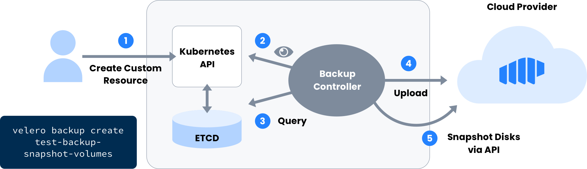

# Kubernetes Backup via Velero

## **Background**

This guide walks through the process of backing up a Kubernetes cluster using Restic with Velero.  Velero is a command-line tool that backs up Kubernetes clusters and restores them in case of loss.  Velero includes a command-line interface and server-side component that runs inside of your Kubernetes cluster.

Velero lets you:

* Take backups of your cluster and restore them in case of loss.
* Migrate cluster resources to other clusters.
* Replicate your production cluster to development and testing clusters.




The Storj DCS Velero plugin does not support volume snapshots for now.


## **Prerequisites**

* [Complete Velero Prerequisites and install the CLI](https://velero.io/docs/main/basic-install/)
* [Create a Storj DCS account](https://storj.io/signup)
* [Create an Access Grant for the project](../getting-started/quickstart-uplink-cli/uploading-your-first-object/create-first-access-grant.md) or create an access grant with the [Uplink CLI](../getting-started/quickstart-uplink-cli/)
* [Create a Storj bucket where Velero will store the backups](../getting-started/quickstart-uplink-cli/uploading-your-first-object/create-a-bucket.md)

## Instructions

**Install Velero with Storj plugin**

```
$ velero install --provider tardigrade \
    --plugins storjlabs/velero-plugin:latest \
    --bucket $BUCKET \
    --backup-location-config accessGrant=$ACCESS \
    --no-secret
```


To generate an access grant ($ACCESS) for the configuration, follow the guide here:  [Sharing Your First Object](../getting-started/quickstart-uplink-cli/sharing-your-first-object/)


**Backup/Restore**

Perform a backup:

```
$ velero backup create $BACKUP_NAME
```

Perform a restore:

```
$ velero restore create $RESTORE_NAME --from-backup $BACKUP_NAME
```


Note: it's possible to overwrite the backup location or access grant by editing the `backupstoragelocations.velero.io` CR and restarting the Velero Pod on the cluster in case of any mistake with the configuration.


The complete Velero documentation is [located here.](https://velero.io/docs/main/restore-reference/)

## Multicloud Architecture for Disaster Prevention and Migration

Because Storj DCS is a globally distributed hot object store, you can store and recover your Kubernetes volumes from anywhere in the world, instantly, without having to replicate data across regions. For DevOps managers, this can mean better resilience for your cluster, reduced global RTO (recovery time objective), cost-savings, and improved native security over centralized alternatives.

In the example below, we can see a Disaster Recovery scenario where we might need to migrate into a new cluster:\
****


In this scenario, Cluster B is restored from the backup of A and reconstituting the Kubernetes volume in the cluster. &#x20;

### Github Source:&#x20;

#### [https://github.com/storj/velero-plugin](https://github.com/storj/velero-plugin)
