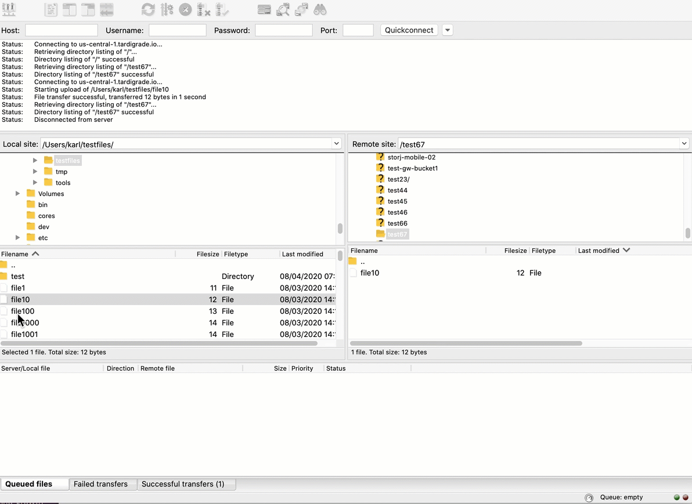

# FileZilla Native Integration


The native integration uses [**end-to-end encryption**](../concepts/encryption-key/design-decision-end-to-end-encryption.md) for your object data, including metadata and path data.



This is the only integration available for the **free version of Filezilla**. If you wish to use the Hosted Gateway MT you will need the paid version of Filezilla.&#x20;


## **Background**

The _**FileZilla**_ Client is a fast and reliable cross-platform (Windows, Linux and Mac OS X) FTP, FTPS and SFTP client with lots of useful features and an intuitive graphical user interface.

It includes a site manager to store all your connection details and logins, as well as an Explorer-style interface that shows the local and remote folders and can be customized independently.

With the launch of the native Storj DCS Integration into the FileZilla client, developers can use the client configured to transfer files, point-to-point using the decentralized cloud.

## Getting Started

.png>)

### Create an Access Grant

Navigate to the **Access** page within your project and then click on **Continue**.&#x20;

Give your new **** Access Grant a **name.**

**Assign** **permissions** to the Access Grant.


If you click "Continue in Browser", our client-side javascript will finalize your access grant with your encryption passphrase. Your data will remain end-to-end encrypted until you explicitly register your access grant with [Gateway MT](../getting-started/gateway-mt/) for S3 compatibility. Only then will your access grant be shared with our servers. Storj does not know or store your encryption passphrase.

However, if you are still reluctant to enter your passphrase into our web application, that's completely understandable, and you should select "Continue in CLI" and follow these [instructions](../getting-started/quickstart-uplink-cli/generate-access-grants-and-tokens/generate-a-token.md).

**The instructions below assume you selected "Continue in Browser."**


Select a **Passphrase** type: Either create your own Encryption Passphrase or Generate a 12-Word Mnemonic Passphrase. Make sure you **save your encryption passphrase** as you'll not be able to reset this after it's created.


**This passphrase is important!** Encryption keys derived from it are used to encrypt your data at rest, and your data will have to be re-uploaded if you want it to change!

Importantly, if you want two access grants to have access to the same data, they must use the same passphrase. You won't be able to access your data if the passphrase in your access grant is different than the passphrase you uploaded the data with.

Please note that **Storj does not know or store your encryption passphrase**, so if you lose it, you will not be able to recover your files.


Access Grant is generated. **The Access Grant will only display once.** Save this information in a password manager or wherever you prefer to store sensitive information.&#x20;

### Downloading FileZilla

To download the latest release of FileZilla, navigate to [https://filezilla-project.org/download.php?show\_all=1](https://filezilla-project.org/download.php?show\_all=1) and select the version appropriate for your operating system, then install FileZilla.

### Creating a new Site

Open the Site Manager by clicking on the leftmost icon.

.png>)

Select the 'New Site' option

.png>)

### Configure the Satellite and Access Grant

Next, select Protocol:  "Storj - Decentralized Cloud Storage" from the Protocol dropdown in the "General" tab.&#x20;

Now enter the **Satellite** and **Access Grant** as shown below (Entering the port is not required)

1. Use the **Satellite** URL from which you created the Access Grant.
   * us-central-1.tardigrade.io (us1.storj.io)
   * asia-east-1.tardigrade.io (ap1.storj.io)
   * europe-west-1.tardigrade.io (eu1.storj.io)
2. For **Access Grant** please enter the Access Grant you saved above.

.png>)

After you enter the above information, hit the "Connect" button, and FileZilla will connect directly to the remote site.  You should see a screen showing your local site vs. Storj DCS, like so:

.png>)

### Uploading a File

To upload a file to your local machine, simply drag it from the local to the remote site (on the decentralized cloud), as shown below:

### Downloading a File

To download a file to your local machine, simply drag it from the remote site to the local site, as shown below:

.gif>)

