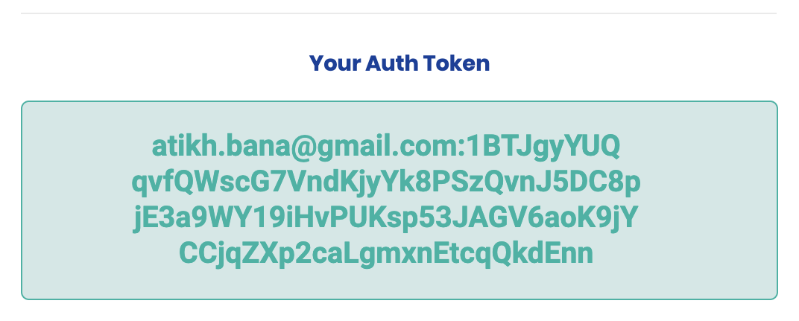

# Before You Begin

## Authorization Token

Make sure you have received an email with your personal single-use authorization token. It looks like this:


If you have not received an authorization token yet, **join our** [**waitlist**](https://storj.io/sign-up-farmer)**.**


If the instructions are a little more complex than you can handle, don’t worry! We’ll continually make the process easier and more accessible for less technical users.

By using your authorization token, you agree to the [Storage Sharing Terms and Conditions](https://storj.io/storj-share-terms/).

