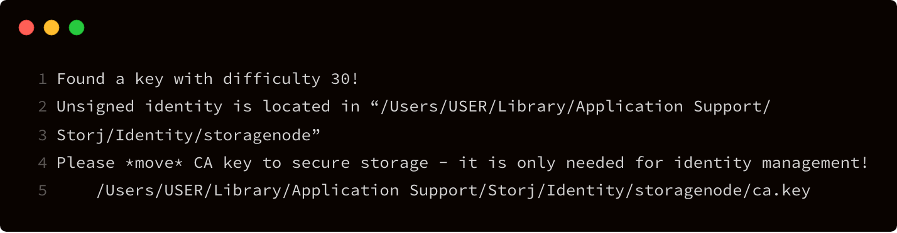
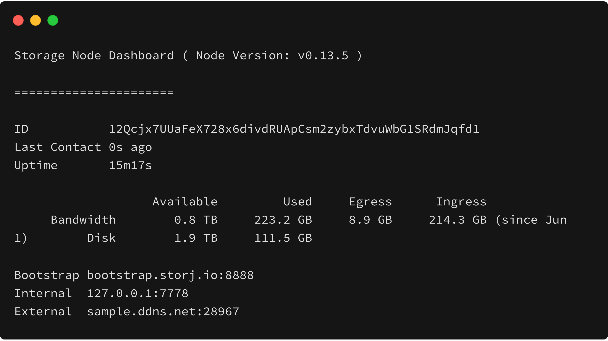

# Storage Node Setup Instructions

## Important Security Consideration


**Do not connect your computer directly to the internet without the assistance of a firewall.**

Our software serves requests from the internet, but not all software you may have installed is designed to be exposed to the internet directly! This is especially true for users on Windows with applications responding to requests on all IPs_._


## Prerequisites

### System Requirements

If your OS is not supported, save your one-time-use authorization token, as it does not expire. We will notify you as updates are made.



Windows 10 64bit: Pro, Enterprise or Education \(Build 15063 or later\) 

Windows Server \(2016 or later\)



CentOS - A maintained version of CentOS 7

Debian - 64-bit version of one of these Debian or Raspbian versions:

* Buster 10
* Stretch 9 \(stable\) / Raspbian Stretch

Fedora - 64-bit version of one of these Fedora versions:

* 28
* 29

Ubuntu - 64-bit version of one of these Ubuntu versions:

* Cosmic 18.10
* Bionic 18.04 \(LTS\)
* Xenial 16.04 \(LTS\)



macOS Sierra 10.12 and newer macOS releases are supported

Mac hardware must be a 2010 or newer model

VirtualBox prior to version 4.3.30 must NOT be installed \(it is incompatible with Docker Desktop for Mac\). If you have a newer version of VirtualBox installed, it’s fine.



### Install Docker

To setup a Storage Node, you first must have Docker installed. Install Docker by following the appropriate installation guide for your OS.



## [Windows Docker **Installation**](https://docs.docker.com/docker-for-windows/install/#install-docker-desktop-for-windows-desktop-app)\*\*\*\*


**Docker Toolbox is not supported**




## [**Ubuntu Docker Installation**](https://docs.docker.com/install/linux/docker-ce/ubuntu/) ****[**CentOS Docker Installation**](https://docs.docker.com/install/linux/docker-ce/centos/) ****[**Debian Docker Installation**](https://docs.docker.com/install/linux/docker-ce/debian/) ****[**Fedora Docker Installation**](https://docs.docker.com/install/linux/docker-ce/fedora/)\*\*\*\*



## \*\*\*\*[**MacOS Docker Installation**](https://docs.docker.com/docker-for-mac/install/)\*\*\*\*



### Set Up Port Forwarding

Set up Port Forwarding & Dynamic DNS. The port you should specify is `28967`. Please read our guide:



You may also visit [portforward.com](https://portforward.com/) and follow the instructions for your router.

### Internet Connection

It is highly recommended to have your Storage Node connected via LAN instead of WiFi to ensure a consistent and stable connection.

### Power Supply

If you live in a location where power outages or brownouts are a frequent occurrence, please consider protecting your hardware, including the equipment you run your node on, as well as your router/modem, with an Uninterrupted Power Supply \(UPS\). This would help protect against damage to your hardware as well as against corruption of your database resulting from abrupt shutdowns which could lead to unrecoverable loss of your node.

### Using a Remote Connection?

If you must use a remote connection, due to the length of time it takes for some of the steps, it is highly recommended to run them inside a virtual console like [TMUX](https://www.hamvocke.com/blog/a-quick-and-easy-guide-to-tmux/) or [SCREEN](https://linuxize.com/post/how-to-use-linux-screen/).

It is recommended to perform the following steps local to the machine, and **not** via a remote connection. 

### Using Synology?

If you are using Synology, you must add `sudo` in front of the commands.

## Setup

Prefer a video tutorial?



### Download the Identity Binary 

Download the binary for your OS and unzip it.



## [Windows Identity Binary](https://storj-v3-alpha-builds.storage.googleapis.com/3cc13da-heads-v0.11.7-go1.12.1/identity_windows_amd64.exe.zip)



## [Linux Identity Binary](https://storj-v3-alpha-builds.storage.googleapis.com/3cc13da-heads-v0.11.7-go1.12.1/identity_linux_amd64.zip)



## [ARM-based Identity Binary](https://storj-v3-alpha-builds.storage.googleapis.com/3cc13da-heads-v0.11.7-go1.12.1/identity_linux_arm.zip)



## [MacOS Identity Binary](https://storj-v3-alpha-builds.storage.googleapis.com/3cc13da-heads-v0.11.7-go1.12.1/identity_darwin_amd64.zip)



### Create an Identity


This can take **several hours or even days**, depending on your machines processing power & luck. 


If you are planning to run your node on a Synology NAS, Raspberry Pi or other device with less computing power, you can create an Identity on a more powerful machine and then transfer it over to the device you will run your node on. 

To create an identity:

1. Open a terminal window.

2. Go to the directory with your identity binary. 

3. Use the `create` command to create an identity: 



```bash
./identity_windows_amd64.exe create storagenode
```

Your identity will be generated in: `$Env:APPDATA/Storj/Identity/storagenode`



```bash
./identity_linux_amd64 create storagenode
```

Your identity will be generated in: `~/.local/share/storj/identity/storagenode`



```bash
./identity_linux_arm create storagenode
```

On Raspberry Pi, your identity will be generated in \(the path may be different for other ARM platforms\): `home/pi/.local/share/storj/identity/storagenode`



```bash
./identity_darwin_amd64 create storagenode
```

Your identity will be generated in: `/Users/USER/Library/Application Support/Storj/identity/storagenode`



4. This process will continue until it reaches a difficulty of 30. On completion, it will look something like this:



### Backup the CA.Key


**Failure to create a complete backup of your CA.Key can result in not being able to recover your node later.** __**Save it now!**


Make a backup of your CA.Key file. This will allow you to restore your node to working order in case of an unfortunate incident such as a hard drive crash. __Find your CA.key here:



Your CA.Key is located in: `$Env:APPDATA/Storj/Identity/storagenode`



Your CA.Key is located in: `~/.local/share/storj/identity/storagenode`



On Raspberry Pi, your CA.Key is located in \(the path may be different for other ARM platforms\): `home/pi/.local/share/storj/identity/storagenode`



Your CA.Key is located in: `/Users/USER/Library/Application Support/Storj/identity/storagenode`



### Sign the Identity

Now, sign the identity you created with your single-use authorization token. 

**Reminder: The entire string including your email is your authorization token.**



```bash
./identity_windows_amd64.exe authorize storagenode <email:characterstring>
```



```bash
./identity_linux_amd64 authorize storagenode <email:characterstring>
```



```bash
./identity_linux_arm authorize storagenode <email:characterstring>
```



```bash
./identity_darwin_amd64 authorize storagenode <email:characterstring>
```



### Download the Storage Node Docker Container

Pull the Storage Node Docker Container.



```bash
docker pull storjlabs/storagenode:alpha
```



```bash
docker pull storjlabs/storagenode:arm
```



## Storage Node Concepts

Before running your Storage Node for the first time, please note the definitions of the parameters to be used.

<table>
  <thead>
    <tr>
      <th style="text-align:left">Parameter</th>
      <th style="text-align:left">Description</th>
    </tr>
  </thead>
  <tbody>
    <tr>
      <td style="text-align:left"><code>WALLET</code>
      </td>
      <td style="text-align:left">your address to receive STORJ token payouts for running the node. <a href="https://storjlabs.atlassian.net/wiki/spaces/SCKB/pages/4489285/How+do+I+hold+STORJ+What+is+a+valid+address+or+compatible+wallet">Learn how to obtain a valid payout address.</a>
      </td>
    </tr>
    <tr>
      <td style="text-align:left"><code>EMAIL</code>
      </td>
      <td style="text-align:left">email address so that we can notify you when a new version has been released
        (optional)</td>
    </tr>
    <tr>
      <td style="text-align:left"><code>ADDRESS</code>
      </td>
      <td style="text-align:left">
        <p>external IP address or the DDNS you configured and the port you opened
          on your router <code>&lt;ip&gt;:&lt;port&gt;</code>
        </p>
        <p></p>
        <p>If you are using a custom port other than 28967, you have to change the <code>-p 28967:28967</code> to <code>-p &lt;port&gt;:28967</code>
        </p>
      </td>
    </tr>
    <tr>
      <td style="text-align:left"><code>BANDWIDTH</code>
      </td>
      <td style="text-align:left">how much bandwidth you can allocate to the Storj network. Be sure to allow
        for other use cases you have for your internet connection, and do not allocate
        more than your ISP supplied up and download speed can physically supply.
        To calculate the maximum monthly BANDWIDTH you can enter here, follow instructions
        <a
        href="https://storjlabs.atlassian.net/wiki/spaces/SCKB/pages/64323607/How+do+I+calculate+my+Total+monthly+bandwidth+from+my+Mbit+s+up-+and+download+speed">here</a>.</td>
    </tr>
    <tr>
      <td style="text-align:left"><code>STORAGE</code>
      </td>
      <td style="text-align:left">
        <p>how much disk space you want to allocate to the Storj network</p>
        <p></p>
        <p>Be sure not to over-allocate space! <b>Allow at least 10% extra for overhead.</b> If
          you over-allocate space, <b>you may corrupt your database</b> when the system
          attempts to store pieces when no more physical space is actually available
          on your drive.</p>
      </td>
    </tr>
    <tr>
      <td style="text-align:left"><code>&lt;identity-dir&gt;</code>
      </td>
      <td style="text-align:left">the path to the location of your identity files. You can copy the absolute
        path from the output of the identity commands you ran earlier.</td>
    </tr>
    <tr>
      <td style="text-align:left"><code>&lt;storage-dir&gt;</code>
      </td>
      <td style="text-align:left">
        <p>the path to the local directory where you want files to be stored on your
          hard drive for the network.</p>
        <p></p>
        <p>Note: the current database backend is <a href="https://github.com/boltdb/bolt">BoltDB</a>,
          which <a href="https://github.com/boltdb/bolt/issues/704">requires <em>mmap</em></a>,
          hence you have to use a file system which supports <em>mmap</em>.</p>
      </td>
    </tr>
  </tbody>
</table>## Running the Storage Node

1. Copy the command format appropriate for your OS into a text editor:



```bash
docker run -d --restart unless-stopped -p 28967:28967 -e WALLET="0xXXXXXXXXXXXXXXXXXXXXXXXXXXXXXXXXXXXXXXXX" -e EMAIL="user@example.com" -e ADDRESS="domain.ddns.net:28967" -e BANDWIDTH="20TB" -e STORAGE="2TB" --mount type=bind,source="<identity-dir>",destination=/app/identity --mount type=bind,source="<storage-dir>",destination=/app/config --name storagenode storjlabs/storagenode:alpha
```

**On Windows, you need to format the paths using double backslashes: `D:\\identity\\storagenode\\` or `D:\\data\\`**



```bash
docker run -d --restart unless-stopped -p 28967:28967 \
    -e WALLET="0xXXXXXXXXXXXXXXXXXXXXXXXXXXXXXXXXXXXXXXXX" \
    -e EMAIL="user@example.com" \
    -e ADDRESS="domain.ddns.net:28967" \
    -e BANDWIDTH="20TB" \
    -e STORAGE="2TB" \
    --mount type=bind,source="<identity-dir>",destination=/app/identity \
    --mount type=bind,source="<storage-dir>",destination=/app/config \
    --name storagenode storjlabs/storagenode:alpha
```



```bash
docker run -d --restart unless-stopped -p 28967:28967 \
    -e WALLET="0xXXXXXXXXXXXXXXXXXXXXXXXXXXXXXXXXXXXXXXXX" \
    -e EMAIL="user@example.com" \
    -e ADDRESS="domain.ddns.net:28967" \
    -e BANDWIDTH="20TB" \
    -e STORAGE="2TB" \
    --mount type=bind,source="<identity-dir>",destination=/app/identity \
    --mount type=bind,source="<storage-dir>",destination=/app/config \
    --name storagenode storjlabs/storagenode:arm
```



2. Edit the `WALLET`, `EMAIL`, `ADDRESS`, `BANDWIDTH`, `STORAGE`, `<identity-dir>`, and `<storage-dir>` with your parameters. 

3. Copy the updated command.

4. Run it in a terminal window.

## Running the Storage Node Dashboard

In order to monitor the functioning of your node, you can start the dashboard:

```bash
docker exec -it storagenode /app/dashboard.sh
```


**Depending on how much data you already have stored on your node, the dashboard may not load instantly.** 

Give it some time to fully load. Also, it is not necessary to keep the dashboard constantly running. You can exit the dashboard with `Ctrl-C` and the Storage Node will continue running in the background.




## Check your Logs

You can look at your logs to see if you have some errors indicating that something is not functioning properly:

```text
docker logs -t storagenode
```

### Log too long? 

Use this command if you just want to see the last 20 lines of the log: 

```text
docker logs --tail 20 storagenode
```

### Redirecting logs to a file

1. To redirect the logs to a file, stop your node: 

```text
docker stop storagenode
```

2. Then edit your config.yaml \(you can use _nano_ or _vi_ editor\) to add: 

```text
log.output: "/app/config/node.log"
```

3. Start your node again with the usual `docker run` command. 

Also, you can redirect logs to a file like this: 

```text
docker logs storagenode 2>&1 > d:\file.txt
```

## Support

If you need help setting up your storage node, sign up for our [community chat](https://community.storj.io/home) to receive interactive assistance. Be sure to provide your logs and stack trace when requested by the community leader attending your issue. 

You can also file a support ticket at [support@storj.io](mailto:support@storj.io).

## Short Maintenance Shutdown

If you need to shutdown the Storage Node for maintenance on your system, run:

```bash
docker stop storagenode
```

After you finished your maintenance, restart the node with:

```bash
docker start storagenode
```

## Updating Your Storage Node

### Automatic Updates

You can set up automatic updates for your Storage Node docker container using `watchtower`. `Watchtower` will look for new updates to the docker container on Docker Hub and automatically update your storage node when it sees a new version. This is the best way to ensure your storage node stays up to date:



```bash
docker run -d --restart=always --name watchtower -v /var/run/docker.sock:/var/run/docker.sock storjlabs/watchtower storagenode watchtower
```



```bash
docker run -d --restart=always --name watchtower -v /var/run/docker.sock:/var/run/docker.sock storjlabs/watchtower:latest-arm32v6 storagenode watchtower
```




This command sets up watchtower to only monitor the Storage Node container. If you want to use watchtower for other containers as well, please refer to the [watchtower documentation.](https://hub.docker.com/r/containrrr/watchtower)


### Manual Updates

1. Stop the running Storage Node container:

```bash
docker stop storagenode
```

2. Remove the existing container:

```bash
docker rm storagenode
```

3. Pull the latest image from docker:



```bash
docker pull storjlabs/storagenode:alpha
```



```bash
docker pull storjlabs/storagenode:arm
```



4. Start your storage node again by running the following command after editing `WALLET`, `EMAIL`, `ADDRESS`, `BANDWIDTH`, `STORAGE`, `<identity-dir>`, and `<storage-dir>`:



```bash
docker run -d --restart unless-stopped -p 28967:28967 -e WALLET="0xXXXXXXXXXXXXXXXXXXXXXXXXXXXXXXXXXXXXXXXX" -e EMAIL="user@example.com" -e ADDRESS="domain.ddns.net:28967" -e BANDWIDTH="20TB" -e STORAGE="2TB" --mount type=bind,source="<identity-dir>",destination=/app/identity --mount type=bind,source="<storage-dir>",destination=/app/config --name storagenode storjlabs/storagenode:alpha
```



```bash
docker run -d --restart unless-stopped -p 28967:28967 \
    -e WALLET="0xXXXXXXXXXXXXXXXXXXXXXXXXXXXXXXXXXXXXXXXX" \
    -e EMAIL="user@example.com" \
    -e ADDRESS="domain.ddns.net:28967" \
    -e BANDWIDTH="20TB" \
    -e STORAGE="2TB" \
    --mount type=bind,source="<identity-dir>",destination=/app/identity \
    --mount type=bind,source="<storage-dir>",destination=/app/config \
    --name storagenode storjlabs/storagenode:alpha
```



```bash
docker run -d --restart unless-stopped -p 28967:28967 \
    -e WALLET="0xXXXXXXXXXXXXXXXXXXXXXXXXXXXXXXXXXXXXXXXX" \
    -e EMAIL="user@example.com" \
    -e ADDRESS="domain.ddns.net:28967" \
    -e BANDWIDTH="20TB" \
    -e STORAGE="2TB" \
    --mount type=bind,source="<identity-dir>",destination=/app/identity \
    --mount type=bind,source="<storage-dir>",destination=/app/config \
    --name storagenode storjlabs/storagenode:arm
```




If you want to change any of your parameters, such as payout address, allotted storage space, bandwidth, etc., just stop and remove the container, and then run the container again after editing the parameter that has changed. You will not need to execute the`docker pull` command in this case.


## Migrating your Node to a new Drive or Computer

If you want to migrate your node to a new drive or computer, you need to migrate both the contents of your storage folder and your identity folder to the new location and change the corresponding paths for both storage and identity folders `--mount` parameters in your `docker run storagenode` command. 

## Execute Other Storage Node Commands

Run `help` to see other commands:

```bash
docker exec -it storagenode /app/storagenode help
```

Run the following to execute other commands:

```bash
docker exec -it storagenode /app/storagenode <<command>>
```

